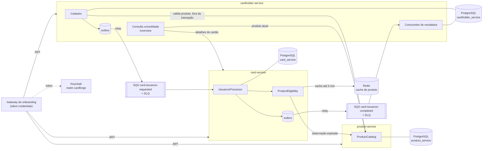

# CardForge

Plataforma de emissão de cartões com três microsserviços Java 21 / Spring Boot 3.5: **catálogo de produtos**, **cadastro de portadores** e **emissão de cartões**. O cadastro e a emissão acontecem separadamente, integrados por SQS: um cadastro é aceito mesmo quando o catálogo, a mensageria ou a emissão estão indisponíveis. A emissão consulta o produto (com cache Redis), decide cada solicitação uma única vez e nunca emite para produto inexistente ou cancelado além de uma janela de 5 minutos.

Tudo sobe localmente com um comando (PostgreSQL, Redis, LocalStack, Keycloak e os três serviços).

- [Como rodar](#como-rodar)
- [Roteiro de demonstração](#roteiro-de-demonstração)
- [Matriz do enunciado](#matriz-do-enunciado)
- [Arquitetura](#arquitetura) · [APIs](#apis) · [Decisões técnicas](#decisões-técnicas) · [Garantias](#como-o-sistema-impede-cartão-para-produto-inexistente-ou-cancelado) · [Falhas](#comportamento-sob-falha-das-dependências) · [Segurança e privacidade](#controles-de-segurança-e-privacidade) · [Testes](#testes) · [Limitações](#limitações-conhecidas) · [Operação](#procedimento-manual-dlq-e-solicitações-pending-antigas)
- Como a solução foi construída (método, artefatos, desvios aprovados): [`docs/PROCESSO.md`](docs/PROCESSO.md). ADRs: [`docs/adr/`](docs/adr/README.md).

## Como rodar

**Pré-requisitos:** Docker com Compose v2. Para o smoke test, `bash`, `curl` e `jq`. Java 21 só para rodar os testes fora do Docker.

```bash
docker compose up -d --build --wait   # sobe infraestrutura e serviços e espera ficarem saudáveis
./scripts/smoke-test.sh               # token -> produto -> cadastro -> emissão pela fila -> consulta
./mvnw verify                         # unitários, integração (Testcontainers) e ArchUnit
```

Na primeira subida, o container `secrets-init` gera a chave HMAC do PAN em `./.local/secrets/pan-hmac-key`, ignorada pelo git. Para recomeçar do zero: `docker compose down -v` e apagar `./.local/`.

| Serviço | URL local | Swagger UI |
|---|---|---|
| Keycloak (realm `cardforge`) | http://localhost:8080 | — |
| product-service | http://localhost:8081 | http://localhost:8081/swagger-ui/index.html |
| cardholder-service | http://localhost:8082 | http://localhost:8082/swagger-ui/index.html |
| card-service | http://localhost:8083 | http://localhost:8083/swagger-ui/index.html |
| LocalStack (SQS) | http://localhost:4566 | — |

**Token** (client credentials; as credenciais do repositório são fixas de desenvolvimento, **só para uso local**):

```bash
TOKEN=$(curl -s -d grant_type=client_credentials -d client_id=onboarding-gateway \
  -d client_secret=onboarding-gateway-local-secret \
  http://localhost:8080/realms/cardforge/protocol/openid-connect/token | jq -r .access_token)
```

No Swagger UI, use **Authorize** com o mesmo `client_id` e `client_secret`.

## Roteiro de demonstração

1. **Fluxo completo:** `./scripts/smoke-test.sh` cria um produto, cadastra um portador, espera a emissão assíncrona e confere o cartão na consulta consolidada e no `card-service`.
2. **Postman:** importe `postman/cardforge.postman_collection.json` e `postman/cardforge-local.postman_environment.json` e rode as pastas em ordem:
   - `0. Auth`: token;
   - `1. Happy path`: produto, cadastro, consulta consolidada (repete até a emissão terminar), cartão e listagens;
   - `2. Errors`: 422, 409 e 404 com `application/problem+json`;
   - `3. Status transitions`: bloqueio, desbloqueio e cancelamento de cartão e portador;
   - `4. Product cancellation`: cancelamento idempotente e cadastro recusado para produto cancelado.

   A collection também roda por linha de comando: `npx newman run postman/cardforge.postman_collection.json -e postman/cardforge-local.postman_environment.json`.
3. **SQS fora durante o cadastro:** `docker compose pause localstack`, cadastre um portador (responde **202**; o `/overview` mostra `PENDING`), depois `docker compose unpause localstack`. O evento sai do outbox e o cartão é emitido.
4. **Catálogo fora:** `docker compose stop product-service`. O cadastro continua sendo aceito, e o `/overview` mostra o produto `STALE` com o instante da última observação. Com `docker compose start product-service`, as emissões retidas saem após o backoff (até 5 minutos).
5. **card-service fora:** `docker compose stop card-service`. O `/overview` de um portador com cartão emitido responde 200 com `issuance.status = ISSUED` e `card.availability = UNAVAILABLE`.

## Matriz do enunciado

| Requisito do enunciado | Onde está atendido |
|---|---|
| Três microsserviços integrados | `product-service`, `cardholder-service` e `card-service`, cada um com o seu database PostgreSQL |
| Produto: cadastro, busca por ID e status (CRUD básico) | `POST`, `GET /{id}`, `GET` paginado, `PATCH` (nome e descrição) e `POST /{id}/cancel`. Sem exclusão física (405) |
| Auditoria simples do produto | `createdAt` e `updatedAt` em todos os agregados |
| Portador com JWT e dados cadastrais | JWT validando emissor, audiência e escopo; nome, CPF e data de nascimento validados (CPF com dígitos verificadores, 18 a 120 anos, nome e sobrenome) |
| Status de portador e cartão | `block`, `unblock` e `cancel`, idempotentes para o status atual; `CANCELED` é terminal |
| Cadastro envia a solicitação para SQS | Outbox transacional com relay; o cadastro é aceito mesmo com a SQS fora |
| Consulta agregada Portador + Cartão + Produto ("Objeto Completo") | `GET /api/v1/cardholders/{id}/overview`, com a disponibilidade de cada parte. Por **minimização de dados**, o portador vem com o CPF mascarado (`***.456.789-**`) e sem a data de nascimento |
| Emissão por consumidor SQS | `card-service` consome `card-issuance-requested`, decide uma única vez e publica o resultado |
| Detalhes do produto ao criar e consultar o cartão, com Redis | Na emissão: observação `ACTIVE` de até 5 minutos, do cache Redis ou do catálogo. Na consulta: `GET /api/v1/cards/{id}` traz a seção `product`, do cache ou do catálogo, com `availability` |
| Java 17/21 e Spring Boot 3.x | Java 21 e Spring Boot 3.5 |
| PostgreSQL, Redis e LocalStack | Um database por serviço; Redis para o cache de produto; SQS no LocalStack com DLQ e redrive |
| Docker Compose com um comando | `docker compose up -d --build --wait`, com healthchecks e dependências por `service_healthy` |
| OpenAPI/Swagger e Postman | Swagger UI nos três serviços, com os tipos de erro documentados; collection com fluxo feliz, erros e transições |
| Tratamento global de exceções e HTTP semântico | `@RestControllerAdvice` com `ProblemDetail` (`application/problem+json`) e um `type` estável por causa de erro |
| Retry e DLQ | Backoff exponencial por `ChangeMessageVisibility`; falhas de negócio sem retry; DLQ com redrive e envio explícito de mensagens inválidas |
| Testes, incluindo integração | Unitários, integração com Testcontainers (PostgreSQL, Redis, LocalStack) e WireMock, e ArchUnit |
| README com decisões técnicas | Este documento e os ADRs em [`docs/adr/`](docs/adr/README.md) |

## Arquitetura



<!-- Texto alternativo: o gateway chama os três serviços com JWT do Keycloak. O cadastro valida o produto no product-service fora da transação e grava portador, solicitação PENDING e evento no outbox do cardholder-service; o relay publica em card-issuance-requested. O card-service consome, decide a elegibilidade do produto (cache Redis de até 5 minutos, senão o catálogo), grava cartão e resultado com o evento no seu outbox e publica em card-issuance-completed. O cardholder-service consome o resultado e o expõe no /overview, que também consulta o produto e o cartão. Cada serviço tem o seu database. -->

- **Hexagonal enxuta por serviço:** `domain` (sem Spring, JPA, AWS SDK ou Jackson, verificado por ArchUnit), `application` (casos de uso e portas), `infrastructure` (persistência, SQS, Redis, HTTP) e `web`.
- **`cardforge-platform`:** código técnico comum aos serviços (outbox e relay, envelope de evento, DLQ explícita, `X-Correlation-Id`, `ProblemDetail`, OpenAPI dos erros, clientes HTTP com client credentials). Não tem tipos de domínio (ArchUnit).
- **Segurança:** os três serviços são Resource Servers e validam emissor, audiência (uma por serviço) e escopo (`products:*`, `cardholders:*`, `cards:*`). Entre serviços, client credentials com os escopos de leitura.
- **Observabilidade:** Actuator só com `health`, `info` e `prometheus`; readiness depende só do banco. Logs JSON (ECS) com `traceId` e `correlationId`. Métricas `cardforge_outbox_pending`, `cardforge_outbox_oldest_age_seconds`, `cardforge_issuance_decisions_total`, `cardforge_product_cache_total`, `cardforge_pan_collisions_total` e `cardforge_bin_occupancy_ratio{bin}`. As decisões de emissão só são contadas depois do commit. A de ocupação é atualizada a cada minuto e gera o log `ALERT BIN occupancy` a partir de 70% da faixa de 10⁷ PANs de cada BIN.

## APIs

Todas exigem `Authorization: Bearer <JWT>` e respondem erros em `application/problem+json`. O contrato completo de cada serviço está no Swagger UI.

### Catálogo de produtos (`product-service`)

| Endpoint | Regra | Escopo |
|---|---|---|
| `POST /api/v1/products` | Cria `ACTIVE`; `bin` com 8 dígitos, único (409 `bin-already-registered`) | `products:write` |
| `GET /api/v1/products?page=&size=` | Paginado, padrão 20, máximo 100 (`size` maior gera 400) | `products:read` |
| `GET /api/v1/products/{id}` | 404 se não existe | `products:read` |
| `PATCH /api/v1/products/{id}` | Só `name` e `description` de produto `ACTIVE`. Campo ausente mantém o valor; `description: null` limpa. `bin` no corpo (inclusive `null`) gera **422 `bin-immutable`**, nunca ignorado. Produto `CANCELED` gera **409 `product-canceled-read-only`** | `products:write` |
| `POST /api/v1/products/{id}/cancel` | `ACTIVE` → `CANCELED` (terminal); repetir responde 200 sem mudança. Cartões já emitidos continuam válidos; novas emissões param em até 5 minutos | `products:write` |

### Portadores (`cardholder-service`)

| Endpoint | Regra | Escopo |
|---|---|---|
| `POST /api/v1/cardholders` | Cadastra o portador e solicita a emissão. **202** significa aceito e rastreável, não cartão emitido; `Location` aponta para o `/overview`. CPF duplicado: 409 `cpf-already-registered`; produto inexistente ou cancelado: 422 | `cardholders:write` |
| `GET /api/v1/cardholders/{id}` | CPF mascarado, sem data de nascimento | `cardholders:read` |
| `GET /api/v1/cardholders/{id}/overview` | Consulta consolidada (abaixo) | `cardholders:read` |
| `POST /api/v1/cardholders/{id}/block`, `/unblock`, `/cancel` | Transições de status | `cardholders:write` |

**Consulta consolidada.** Sempre responde 200 quando o portador existe. O estado de negócio (`issuance.status`) fica separado da completude de cada parte (`availability`):

| Caso | `issuance.status` | `card.availability` | `product.availability` |
|---|---|---|---|
| Pendente | `PENDING` | `NOT_APPLICABLE` | `CURRENT` ou `STALE` |
| Falha de negócio | `FAILED` (com `failureReason`) | `NOT_APPLICABLE` | `CURRENT` ou `STALE` |
| Emitido, card-service fora | `ISSUED` (com `cardId`) | `UNAVAILABLE` | `CURRENT` ou `STALE` |
| Produto desatualizado | qualquer | qualquer | `STALE` (com `observedAt`) |
| Produto sem observação | qualquer | qualquer | `UNAVAILABLE` |

O `cardholder-service` guarda a última observação de cada produto, gravada no cadastro e a cada consulta bem-sucedida ao catálogo. O produto sai `CURRENT` quando veio do catálogo na própria requisição e `STALE` quando veio dessa observação guardada. Os detalhes do cartão vêm sempre do `card-service`.

### Cartões (`card-service`)

| Endpoint | Regra | Escopo |
|---|---|---|
| `GET /api/v1/cards/{id}` | Cartão (só `panLastFour`) com a seção `product` | `cards:read` |
| `GET /api/v1/cards?cardholderId=&page=&size=` | Cartões do portador, paginado (padrão 20, máximo 100) | `cards:read` |
| `POST /api/v1/cards/{id}/block`, `/unblock`, `/cancel` | Transições de status | `cards:write` |

**Produto na consulta do cartão.** É só leitura e não participa da regra de emissão:
- a seção vem do cache Redis em qualquer idade: `CURRENT` até 5 minutos, `STALE` depois, sempre com `observedAt`;
- sem registro no cache, vem do catálogo (`CURRENT`);
- sem nenhum dos dois, `UNAVAILABLE`.

Um cartão de produto cancelado continua consultável, com o produto `CANCELED`.

### Transições de status

- `ACTIVE` ↔ `BLOCKED`; `ACTIVE` ou `BLOCKED` → `CANCELED`, terminal.
- Pedido para o status atual responde **200 sem mudança**. A partir de `CANCELED`, `block` e `unblock` respondem **409** `invalid-status-transition`.
- As transições são métodos do agregado, aplicados com lock de linha, e atualizam `status` e `updatedAt`.
- Cancelar um cartão libera a regra de "um cartão não cancelado por portador e produto": o portador pode receber um novo cartão do mesmo produto.

## Decisões técnicas

Os ADRs completos estão em [`docs/adr/`](docs/adr/README.md).

### Estratégia de cache: janela de 5 minutos

O `card-service` é a única autoridade sobre "o produto pode emitir agora?" (`ProductEligibility`).

- O cache é um adaptador explícito (sem `@Cacheable`): um registro por produto em `cardforge:product:v1:{productId}`, em JSON, com `productId`, `name`, `bin`, `status` e `validatedAt`, e TTL físico de 24 h.
- **A emissão só usa o registro se ele for `ACTIVE` e tiver `validatedAt` de no máximo 5 minutos (inclusivo).** Ler o cache nunca renova `validatedAt`: só uma resposta nova do catálogo grava um instante novo.
- Registro ausente, expirado ou ilegível: o catálogo é consultado **uma vez por processamento**. `ACTIVE` grava um registro novo, com o instante anterior à chamada, o que é conservador.
- **Lápide de cancelamento:** `CANCELED` é gravado no lugar do registro e nunca é substituído, porque o cancelamento é terminal. Enquanto a lápide existir (24 h), a emissão é recusada com `PRODUCT_CANCELED` sem consultar o catálogo. Um 404 também é gravado (`NOT_FOUND`), mas não recusa sozinho: o catálogo é consultado de novo.
- **Gravação atômica e condicional** (script Lua no Redis): vence a observação mais recente. Uma resposta `ACTIVE` de uma consulta iniciada antes do cancelamento, que chegue depois, nunca restaura o registro.
- Redis indisponível: a leitura vira consulta ao catálogo, e a degradação é registrada em log e na métrica `cardforge_product_cache_total{result="error"}`. Redis e catálogo indisponíveis juntos são falha técnica, com retentativa pela fila.

Um produto cancelado pode, no pior caso, ainda autorizar emissões por até 5 minutos. É a janela aceita pela regra de negócio.

### Outbox transacional

Nenhum serviço publica na SQS a partir da transação de negócio.

- O evento é gravado em `outbox_events` **na mesma transação** do dado de negócio: portador, solicitação e evento no cadastro; resultado, cartão e evento na emissão.
- Um worker agendado em cada serviço que publica seleciona lotes de até 10 eventos com `FOR UPDATE SKIP LOCKED` e envia por `SendMessageBatch` com timeout de 5 s, mantendo o lock. Só os eventos aceitos individualmente são marcados como enviados.
- Uma resposta perdida pode gerar republicação; os consumidores absorvem duplicatas.
- O `correlationId` vai no envelope e no atributo SQS, e continua no serviço que consome.

### Idempotência

- **Emissão (`card-service`):** a tabela `issuance_processing` tem uma linha por `issuanceRequestId`, gravada com `ON CONFLICT DO NOTHING`.
  - Solicitação já decidida nunca é reavaliada: o resultado persistido é recolocado no outbox e a mensagem é confirmada.
  - Duas entregas simultâneas da mesma mensagem geram um único cartão: a segunda espera o commit da primeira e republica o mesmo resultado.
  - Unicidade garantida no banco: um cartão por solicitação, PAN único e o índice parcial de um cartão não cancelado por portador e produto.
- **Resultado (`cardholder-service`):** idempotente por estado. `PENDING` aplica; o mesmo resultado de novo não muda nada; resultado contraditório não muda nada, gera alerta e vai para a DLQ.
- **Cadastro:** um cadastro repetido é barrado pela unicidade do CPF (409 `cpf-already-registered`). Não há `Idempotency-Key` nesta versão (ver [débitos](#débitos-e-desvios-conscientes)).

### Retry e DLQ

Filas SQS Standard, cada uma com DLQ e redrive policy, criadas por `infra/localstack/init-queues.sh`. A DLQ retém 14 dias e a fila de origem 4, porque a mensagem mantém o timestamp original ao ir para a DLQ.

| Falha no `card-service` | O que acontece |
|---|---|
| Negócio (produto inexistente ou cancelado, cartão já existente) | Grava `FAILED` com o motivo e publica o resultado na mesma transação; confirma a mensagem. **Sem retry.** |
| Técnica (catálogo com timeout, 5xx ou conexão recusada; Redis e catálogo fora; banco ou transação indisponíveis; PAN sem espaço após 20 tentativas) | Rollback, nada gravado. A mensagem **não é confirmada** e a próxima entrega é adiada por `ChangeMessageVisibility`: 30 s na primeira falha, dobrando a cada recebimento, jitter de ±20% e teto rígido de 5 min aplicado depois do jitter. |
| Configuração (401, 403 ou resposta fora do contrato do catálogo) | Log `ALERT configuration` e o mesmo backoff da falha técnica. Nunca é tratada como produto inexistente. |
| Mensagem inválida (inclusive corpo `null`) ou versão desconhecida | Enviada de forma explícita e imediata para `card-issuance-requested-dlq`, com alerta em log. |

`maxReceiveCount` de `card-issuance-requested` é 29, o que dá um orçamento nominal de cerca de 2 h de retentativas antes da DLQ. No `cardholder-service`, resultados inválidos, desconhecidos ou contraditórios vão direto para `card-issuance-completed-dlq`.

## Como o sistema impede cartão para produto inexistente ou cancelado

1. **No cadastro:** o `cardholder-service` consulta o catálogo antes da transação. Produto comprovadamente inexistente (404) ou `CANCELED` gera 422 (`product-not-found` ou `product-canceled`), e nada é criado.
2. **Na emissão, que é a decisão que vale:** o `card-service` só emite com uma observação `ACTIVE` do produto de no máximo 5 minutos. Se o cache não tiver uma observação válida, consulta o catálogo. `CANCELED` encerra a solicitação como `FAILED`/`PRODUCT_CANCELED`, e 404 como `FAILED`/`PRODUCT_NOT_FOUND`, sem retry.
3. **Erros técnicos nunca viram "produto inexistente":** timeout, 5xx, 401, 403 e contrato inválido adiam a emissão, com retry e alerta, mas nunca a decidem.
4. **Produto cancelado depois do cadastro também é barrado:** a emissão reconsulta o catálogo sempre que a observação passa de 5 minutos. O teste `issuanceStopsOnceTheLastActiveObservationIsOlderThanFiveMinutes` adianta o relógio. Aos 4 minutos, a observação `ACTIVE` ainda autoriza; passados 5, a emissão é recusada com `PRODUCT_CANCELED`.
5. **Cancelamento conhecido é definitivo:** depois que o `card-service` observa `CANCELED`, a lápide no cache recusa novas emissões na hora, e nenhuma resposta `ACTIVE` antiga pode desfazê-la. Isso vale também para a emissão em andamento: se a resposta `ACTIVE` dela chega depois da lápide, a gravação é recusada e a emissão segue o cancelamento.
6. **A idade da observação é conferida no ponto da emissão:** a observação que autorizou é verificada de novo dentro da transação, com o relógio desse momento. Se passou de 5 minutos durante a espera (conexão, lock), a transação é desfeita e a decisão recomeça com uma observação atual.
7. **Resposta fora do contrato nunca decide:** um `200` do catálogo com status nulo, desconhecido ou com BIN inválido é erro de configuração (alerta e retry), nunca "produto inexistente" nem "cancelado".

## Comportamento sob falha das dependências

| Dependência fora | Cadastro (`POST /cardholders`) | Emissão | Consulta consolidada (`/overview`) |
|---|---|---|---|
| **SQS** | **202.** O evento fica pendente no outbox (`cardforge_outbox_pending`) e é publicado quando a SQS volta. | Não recebe mensagens; retoma sozinha quando a SQS volta. Resultados ficam no outbox do `card-service`. | Funciona: mostra `PENDING` até o resultado chegar. |
| **Catálogo (`product-service`)** | **202.** Timeout, 5xx ou conexão recusada fazem o cadastro seguir, e a validação fica para a emissão. 401, 403 ou contrato inválido também aceitam, com `ALERT configuration`. | Usa a observação em cache se tiver até 5 min. Sem ela, falha técnica com backoff até o catálogo voltar. | 200 com `product.availability = STALE` e o `observedAt` da última observação guardada; `UNAVAILABLE` se nunca houve observação. |
| **Redis** | Não usa. | Consulta o catálogo direto e registra a degradação. | Não usa. |
| **card-service** | Não depende. | — | 200 com `issuance.status = ISSUED`, `cardId` preservado e `card.availability = UNAVAILABLE`. |
| **Keycloak** | Tokens já emitidos seguem válidos até expirar (5 min). Sem token novo, a chamada ao catálogo falha como indisponibilidade e o cadastro é aceito. | Mesma regra: falha técnica com backoff. | Partes do produto e do cartão ficam indisponíveis. |
| **PostgreSQL do serviço** | 5xx; readiness fica `DOWN`. | A mensagem não é confirmada e volta depois. | 5xx. |

Todas as chamadas remotas têm timeout configurado:
- HTTP entre serviços: connect de 0,5 s a 1 s e read de 1 s a 2 s, inclusive na chamada que busca o token;
- Redis: 500 ms;
- SQS: 5 s no relay e na DLQ;
- banco: `connection-timeout` de 3 s e `socketTimeout` de 15 s.

**Falha transitória não é perda de fila.** Com a SQS fora por algum tempo, nada se perde: o outbox guarda os eventos e o consumidor retoma. O LocalStack local, porém, não tem persistência. Recriar o container apaga as filas e as mensagens já publicadas, e as solicitações afetadas ficam `PENDING` até serem republicadas pelo [procedimento manual](#procedimento-manual-dlq-e-solicitações-pending-antigas).

## Controles de segurança e privacidade

Estes são **controles de aplicação adotados**, alinhados a práticas de PCI-DSS e LGPD. **Esta versão não afirma conformidade integral com PCI-DSS nem com LGPD.**

| Controle | Como está implementado | Onde é verificado |
|---|---|---|
| PAN nunca guardado por completo | Só `pan_hmac` (HMAC-SHA256 com chave dedicada) e `pan_last_four`; o PAN existe só em memória na emissão; sem CVV ([ADR-0008](docs/adr/0008-pan-hmac-only.md)) | `LuhnAndPanTest`, `IssuanceIT` (resposta sem `pan` ou `panHmac`) |
| Exibição só dos 4 últimos dígitos | APIs e `/overview` expõem apenas `panLastFour` | `IssuanceIT`, `RegistrationIT` |
| Chave do PAN fora do repositório e validada | Gerada em `./.local/secrets` (ignorado pelo git); a inicialização falha se estiver ausente ou fora do formato | `HmacPanHasherTest` |
| CPF protegido | Guardado só com dígitos; respostas com `maskedCpf` (`***.456.789-**`); a data de nascimento nunca é devolvida (minimização de dados) | `RegistrationIT` |
| CPF fora dos logs, inclusive em duplicidade | O cadastro usa `ON CONFLICT (cpf) DO NOTHING`: o CPF repetido não gera erro no banco, então não aparece no log do PostgreSQL nem no do Hibernate | `RegistrationIT.duplicateCpfNeverLeaksTheCpfToLogs` |
| Nada sensível nos logs da aplicação | `toString()` de `Cpf`, `Cardholder`, `Pan` e dos DTOs de cadastro não expõe dados pessoais; os logs usam só IDs | `CpfTest`, `CardholderTest`, `LuhnAndPanTest` |
| Nada sensível em mensagens e erros | Eventos só com IDs; `ProblemDetail` sem CPF, data de nascimento, PAN ou o payload original | `RegistrationIT` (payload do outbox e da mensagem publicada) |
| Autenticação e autorização | JWT validando emissor, audiência (uma por serviço) e escopo; client credentials entre serviços; 401 e 403 em `ProblemDetail` | `ProductApiIT` e os ITs de escopo dos demais serviços |
| Superfície mínima | Actuator só com `health`, `info` e `prometheus`; portas do Compose só em `127.0.0.1`; containers com usuário não root e imagens com versão fixada | `docker-compose.yml` e `Dockerfile` |
| Histórico auditável | **Não implementado nesta versão**: as mudanças de status atualizam só `updatedAt` | — |

## Testes

`./mvnw verify` roda os unitários (`*Test`), os de integração (`*IT`) com Testcontainers (PostgreSQL, Redis, LocalStack) e WireMock, e o ArchUnit. O relatório de cobertura do JaCoCo fica em `target/site/jacoco` de cada módulo.

| Garantia | Teste |
|---|---|
| SQS fora no cadastro; publicação pelo outbox depois da recuperação | `RegistrationIT.sqsUnavailableKeepsEventInOutboxUntilItRecovers` |
| Reentrega depois do commit, sem novo efeito | `IssuanceIT.redeliveryAfterCommitRepublishesWithoutNewEffect` |
| Mensagens duplicadas simultâneas geram um único cartão | `IssuanceIT.duplicateDeliveryIssuesSingleCard` |
| Recusa de negócio sem retry, e reentregue sem mudar o desfecho | `IssuanceIT.canceledProductFailsWithoutRetry`, `IssuanceIT.redeliveredBusinessRefusalKeepsItsOutcome` |
| Solicitações concorrentes para o mesmo portador e produto: só uma emite | `IssuanceIT.concurrentRequestsForSameCardholderAndProductIssueOnlyOneCard` |
| Catálogo fora (5xx, timeout, cache vencido): nenhuma emissão, retentativa com backoff | `IssuanceIT.catalogServerError…`, `catalogTimeout…`, `staleCacheWithCatalogDownDoesNotIssueAndRetries` |
| Cancelamento conhecido impede o uso de observação `ACTIVE` antiga, inclusive por uma resposta concorrente | `IssuanceIT.knownCancellationRefusesIssuanceWithoutCatalog`, `IssuanceIT.activeResponseLosingToAKnownCancellationDoesNotIssue`, `RedisProductCacheIT` |
| Emissão para em até 5 minutos depois do cancelamento, com a idade conferida no ponto da emissão | `IssuanceIT.issuanceStopsOnceTheLastActiveObservationIsOlderThanFiveMinutes`, `IssuanceIT.observationThatExpiresBeforeTheIssuingTransactionIsNotUsed` |
| Resposta do catálogo fora do contrato e corpo `null` nunca decidem | `IssuanceIT.catalogResponseOutOfContractNeverDecides`, `IssuanceIT.nullMessageBodyGoesToDeadLetterQueue`, `RegistrationIT.catalogWithNullStatusIsAContractErrorNotAServerError`, `RegistrationIT.nullResultBodyGoesToDeadLetterQueue` |
| Falha de banco no consumidor segue o backoff | `IssuanceRequestedListenerTest` |
| Paginação além do limite responde 400, não 500 | `ProductApiIT.productListingRejectsPagesBeyondTheSupportedOffset`, `IssuanceIT.cardListingRejectsPagesBeyondTheSupportedOffset` |
| Colisão forçada de PAN | `IssuanceIT.panCollisionIsResolvedWithANewCandidate` |
| Produto na consulta do cartão: atual, desatualizado, catálogo, indisponível, cancelado | `IssuanceIT.cardQuery…`, `IssuanceIT.cardOfCanceledProductRemainsQueryable` |
| Consulta consolidada distingue os cinco casos | `RegistrationIT.consolidatedViewDistinguishesTheFiveCases` |
| CPF fora dos logs em duplicidade | `RegistrationIT.duplicateCpfNeverLeaksTheCpfToLogs` |

Nos testes de maior valor, a proteção foi desligada temporariamente para confirmar que o teste falha pelo motivo certo (ver [`docs/PROCESSO.md`](docs/PROCESSO.md)).

## Débitos e desvios conscientes

Por restrição de prazo, esta versão fez cortes aprovados explicitamente. Cada um tem um caminho de evolução. A regra interna afetada por cada um está em [`docs/PROCESSO.md`](docs/PROCESSO.md).

| # | Desvio | Caminho de evolução |
|---|---|---|
| D1 | **Credenciais fixas de desenvolvimento** no realm do Keycloak, no `docker-compose.yml` (senhas do Postgres, client secrets, admin do Keycloak) e no environment do Postman. **Uso exclusivamente local.** | Gerar senhas e client secrets em `./.local/secrets`, renderizar o realm a partir de um template e gerar o environment do Postman. Em produção, Secrets Manager/KMS. |
| D2 | **Só a chave HMAC do PAN é gerada**, e a validação na inicialização checa só a presença e o formato dela (Base64, ≥ 32 bytes). | Gerar e validar as chaves de cifragem e de idempotência junto com D3 e D4, incluindo a distinção entre elas. |
| D3 | **O PAN completo não é persistido:** só o HMAC (unicidade) e os 4 últimos dígitos. Sem AES-256-GCM. | Mais restritivo que o previsto: nenhum PAN é recuperável. Se algum consumidor precisar do PAN (ex.: embossing), tokenização ou cofre com AES-256-GCM e rotação de chaves. |
| D4 | **Sem `Idempotency-Key` no cadastro.** Duplicidade barrada pela unicidade do CPF (409). | Tabela de chaves por cliente, com fingerprint HMAC, replay do recibo por 24 h e limpeza periódica. Hoje, um cliente que perdeu o recibo e repete recebe 409, sem o recibo original. |
| D5 | **Sem histórico de transições de status:** só `createdAt` e `updatedAt`. | Tabela de transições por agregado, gravada na transação da mudança, com o cliente e o ator. |
| D6 | **Cobertura só com relatório**, sem piso mínimo. | Regra `check` do JaCoCo no `verify` (80% de linhas por módulo). |
| D7 | **Spotless só formata** (`./mvnw spotless:apply`), sem checagem no build. | `spotless:check` na fase `verify`. |
| D8 | **Sem SpotBugs/FindSecBugs.** O ArchUnit protege as camadas. | Plugin no `verify`, restrito a segurança e correção de alta prioridade. |
| D9 | **CI só com `./mvnw verify`**, sem smoke test do Compose, Trivy ou Dependabot. O Compose é verificado manualmente, no teste de clone limpo antes da entrega. **Risco:** uma quebra no Compose, no realm ou nas filas passa pelo CI. | Job com `docker compose up -d --build --wait && ./scripts/smoke-test.sh`; Trivy; Dependabot semanal. |
| D10 | **Smoke test reduzido:** não verifica a chave no Redis nem o `correlationId` nos logs. | Acrescentar essas verificações. |
| D11 | **O `traceparent` não atravessa a fila.** É propagado entre serviços via HTTP; na SQS, o consumidor começa um trace novo, e o `correlationId` liga o fluxo de ponta a ponta. | Gravar o `traceparent` no outbox e restaurá-lo no consumidor. |
| D12 | **Sem reconciliação automática** de solicitações `PENDING` antigas. A recuperação é manual (procedimento abaixo). | Job agendado que republica pelo outbox, com limite de tentativas e alerta. A republicação é segura: o `card-service` nunca emite duas vezes para a mesma solicitação. |

## Limitações conhecidas

- **Circuit breaker** por dependência: não implementado. Os timeouts curtos e a retentativa pela fila limitam o impacto.
- **Outbox sem limpeza:** as linhas enviadas não são removidas.
- **Métrica de profundidade das filas e DLQs:** não implementada; use `ApproximateNumberOfMessages` pela CLI (procedimento abaixo).
- **Status do portador não bloqueia a emissão pendente:** um portador bloqueado ou cancelado depois do cadastro ainda recebe o cartão pendente, até existir a cascata de status.
- **Spring Boot 3.5.x** está fora do suporte OSS desde junho de 2026; a migração para 4.x está planejada no [ADR-0001](docs/adr/0001-java-21-spring-boot-3-5-monorepo.md).
- **Os logs de erro do Spring Cloud AWS** incluem o stack trace a cada falha técnica retentada. É ruído, não perda: a mensagem volta após o backoff.

## Procedimento manual: DLQ e solicitações PENDING antigas

Sem reconciliação automática (D12), este é o procedimento para recuperar solicitações sem desfecho. Ele é seguro porque o `card-service` nunca reavalia uma solicitação já decidida: republicar só reenvia o resultado persistido, sem gerar outro cartão.

**1. Listar solicitações `PENDING` antigas** (mais de 3 h, acima do orçamento de retry de cerca de 2 h):

```bash
docker compose exec -T postgres psql -U postgres -d cardholder_service -c "
  SELECT id, cardholder_id, product_id, requested_at FROM issuance_requests
  WHERE status = 'PENDING' AND requested_at < now() - interval '3 hours'
  ORDER BY requested_at;"
```

**2. Ver se o `card-service` já decidiu** (se sim, só o resultado se perdeu):

```bash
docker compose exec -T postgres psql -U postgres -d card_service -c "
  SELECT * FROM issuance_processing WHERE issuance_request_id = '<issuanceRequestId>';"
```

**3. Inspecionar as DLQs** e corrigir a causa antes de reprocessar (catálogo, credenciais, mensagem inválida):

```bash
docker compose exec -T localstack awslocal sqs get-queue-attributes \
  --queue-url http://localhost:4566/000000000000/card-issuance-requested-dlq \
  --attribute-names ApproximateNumberOfMessages
docker compose exec -T localstack awslocal sqs receive-message \
  --queue-url http://localhost:4566/000000000000/card-issuance-requested-dlq \
  --max-number-of-messages 10 --message-attribute-names All
```

Os alertas aparecem nos logs com o prefixo `ALERT` (`ALERT configuration`, `ALERT invalid issuance request`, `ALERT issuance result sent to DLQ`, `ALERT PAN space`).

**4. Redrive da DLQ para a fila de origem**, depois de corrigida a causa:

```bash
docker compose exec -T localstack awslocal sqs start-message-move-task \
  --source-arn arn:aws:sqs:us-east-1:000000000000:card-issuance-requested-dlq
```

Mensagens em `card-issuance-completed-dlq` são resultados contraditórios, desconhecidos ou inválidos. Investigue antes de mover: uma contradição voltaria direto para a DLQ.

**5. Republicar uma solicitação sem mensagem** (nem na fila nem na DLQ). O evento entra no outbox do `cardholder-service`, e o relay o publica:

```bash
docker compose exec -T postgres psql -U postgres -d cardholder_service -c "
  INSERT INTO outbox_events (event_id, aggregate_id, destination, event_type, event_version,
                             occurred_at, correlation_id, payload)
  SELECT gen_random_uuid(), r.id, 'card-issuance-requested', 'IssuanceRequested', 1, now(),
         'manual-reconciliation',
         jsonb_build_object('issuanceRequestId', r.id, 'cardholderId', r.cardholder_id,
                            'productId', r.product_id)
  FROM issuance_requests r
  WHERE r.id = '<issuanceRequestId>' AND r.status = 'PENDING';"
```

Acompanhe pelo `/overview` do portador ou pelo `correlationId` `manual-reconciliation` nos logs.
