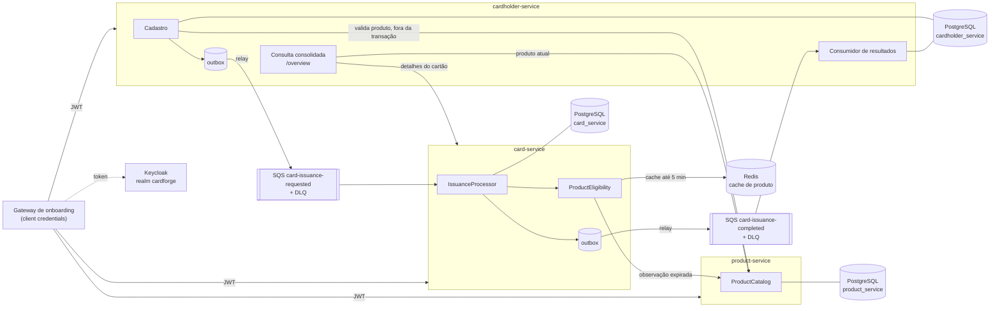

# CardForge: Release 1.0

Plataforma de emissão de cartões da RPE. O cadastro do portador e a emissão do cartão acontecem separadamente: um cadastro é aceito mesmo quando o catálogo, a mensageria ou a emissão estão indisponíveis. Cada solicitação aceita tem no máximo um desfecho terminal, que nunca é reavaliado; enquanto não o tiver, permanece rastreável e recuperável.

Três serviços Spring Boot (`product-service`, `cardholder-service`, `card-service`) e um módulo técnico comum (`cardforge-platform`) num monorepo Maven. O ambiente local completo sobe com um único comando.

## Setup

**Pré-requisitos:** Docker (com Compose v2), e para o smoke test `bash`, `curl` e `jq`. Java 21 é necessário só para rodar os testes fora do Docker.

```bash
# 1. Sobe PostgreSQL, Redis, LocalStack, Keycloak e os três serviços (espera ficarem saudáveis)
docker compose up -d --build --wait

# 2. Fluxo ponta a ponta: token -> produto -> cadastro -> emissão pela fila -> /overview
./scripts/smoke-test.sh

# 3. Testes unitários, de integração (Testcontainers), ArchUnit e relatório de cobertura
./mvnw verify
```

Na primeira subida, o container `secrets-init` gera a chave HMAC do PAN em `./.local/secrets/pan-hmac-key` (ignorado pelo git). Para recomeçar do zero: `docker compose down -v` e apagar `./.local/`.

| Serviço | URL local | Swagger UI |
|---|---|---|
| Keycloak (realm `cardforge`) | http://localhost:8080 | — |
| product-service | http://localhost:8081 | http://localhost:8081/swagger-ui/index.html |
| cardholder-service | http://localhost:8082 | http://localhost:8082/swagger-ui/index.html |
| card-service | http://localhost:8083 | http://localhost:8083/swagger-ui/index.html |
| LocalStack (SQS) | http://localhost:4566 | — |

**Token para chamadas manuais** (credenciais fixas de desenvolvimento, só para uso local):

```bash
curl -s -d grant_type=client_credentials -d client_id=onboarding-gateway \
  -d client_secret=onboarding-gateway-local-secret \
  http://localhost:8080/realms/cardforge/protocol/openid-connect/token | jq -r .access_token
```

No Swagger UI, use **Authorize** com o mesmo `client_id` e `client_secret`.

**Postman:** importe `postman/cardforge.postman_collection.json` e o environment `postman/cardforge-local.postman_environment.json`. Rode a pasta `0. Auth`, depois `1. Happy path` (o passo do `/overview` repete a consulta até a emissão terminar) e `2. Errors` (422, 409 e 404). A collection também roda por linha de comando: `npx newman run postman/cardforge.postman_collection.json -e postman/cardforge-local.postman_environment.json`.

## Arquitetura



<!-- Texto alternativo: o gateway chama os três serviços com JWT do Keycloak. O cadastro valida o produto no product-service fora da transação e grava portador, solicitação PENDING e evento no outbox do cardholder-service; o relay publica em card-issuance-requested. O card-service consome, decide a elegibilidade do produto (cache Redis de até 5 minutos, senão o catálogo), grava cartão e resultado com o evento no seu outbox e publica em card-issuance-completed. O cardholder-service consome o resultado e o expõe no /overview, que também consulta o produto e o cartão. Cada serviço tem o seu database. -->

- **Hexagonal enxuta por serviço:** `domain` (sem Spring, JPA, AWS SDK ou Jackson, verificado por ArchUnit), `application` (casos de uso e portas), `infrastructure` (persistência, SQS, Redis, HTTP) e `web`.
- **`cardforge-platform`** (ADR-004 do Desenho de Domínio): outbox e relay, envelope de evento, leitura de eventos, DLQ explícita, propagação de `X-Correlation-Id`, `ProblemDetail` com os tipos do contrato C6 e clientes HTTP com client credentials. Não tem tipos de domínio (ArchUnit).
- **Segurança:** os três serviços são Resource Servers e validam emissor, audiência (uma por serviço) e escopo (`products:*`, `cardholders:*`, `cards:*`). Entre serviços, client credentials com os escopos de leitura. 401 e 403 saem em `application/problem+json`.
- **Observabilidade:** Actuator só com `health`, `info` e `prometheus`; readiness depende só do banco. Logs JSON (ECS) com `traceId` e `correlationId`. Métricas `cardforge_outbox_pending`, `cardforge_outbox_oldest_age_seconds`, `cardforge_issuance_decisions_total`, `cardforge_product_cache_total`, `cardforge_pan_collisions_total` e `cardforge_bin_occupancy_ratio{bin}` (atualizada a cada minuto, com log `ALERT BIN occupancy` a partir de 70% da faixa de 10⁷ PANs de cada BIN).

## Decisões técnicas

Os ADRs completos estão em [`docs/adr/`](docs/adr/README.md). Esta seção resume as decisões centrais.

### Estratégia de cache: janela de 5 minutos

O `card-service` é a única autoridade sobre "o produto pode emitir agora?" (`ProductEligibility`).

- O cache é um adaptador explícito (sem `@Cacheable`): um registro por produto em `cardforge:product:v1:{productId}`, em JSON, com `productId`, `name`, `bin`, `status` e `validatedAt`, e TTL físico de 24 h.
- **A emissão só usa o registro se ele for `ACTIVE` e tiver `validatedAt` de no máximo 5 minutos (inclusivo).** Ler o cache nunca renova `validatedAt`: só uma resposta nova do catálogo grava um instante novo.
- Registro ausente, expirado ou ilegível: o catálogo é consultado **uma vez por processamento**. `ACTIVE` grava um registro novo, com o instante anterior à chamada, o que é conservador.
- **Lápide de cancelamento (TC7):** `CANCELED` é gravado no lugar do registro e nunca é substituído, porque `CANCELED` é terminal (BR1.2). Enquanto a lápide existir (24 h), a emissão é recusada com `PRODUCT_CANCELED` sem consultar o catálogo. Um 404 também é gravado (`NOT_FOUND`), mas não recusa sozinho: o catálogo é consultado de novo.
- **Gravação atômica e condicional** (script Lua no Redis): vence a observação mais recente. Uma resposta `ACTIVE` de uma consulta iniciada antes do cancelamento, que chegue depois, nunca restaura o registro.
- Redis indisponível: a leitura vira consulta ao catálogo e a degradação é registrada em log e na métrica `cardforge_product_cache_total{result="error"}`. Redis e catálogo indisponíveis juntos são falha técnica, com retentativa pela fila.

Com isso, um produto cancelado pode, no pior caso, ainda autorizar emissões por até 5 minutos, que é a janela aceita pela regra BR4.1.

### Outbox transacional

Nenhum serviço publica na SQS a partir da transação de negócio.

- O evento é gravado em `outbox_events` **na mesma transação** do dado de negócio: portador, solicitação e evento no cadastro; resultado, cartão e evento na emissão.
- Um worker agendado em cada serviço que publica seleciona lotes de até 10 eventos com `FOR UPDATE SKIP LOCKED` e envia por `SendMessageBatch` com timeout de 5 s, mantendo o lock. Só os eventos aceitos individualmente são marcados como enviados.
- Resposta perdida pode gerar republicação. Os consumidores absorvem duplicatas.
- `eventId` identifica a linha de outbox e muda a cada publicação; a identidade de negócio é o `issuanceRequestId` do payload.
- O `correlationId` vai no envelope e no atributo SQS, e continua no serviço que consome.

### Idempotência

- **Emissão (`card-service`):** a tabela `issuance_processing` tem uma linha por `issuanceRequestId`, gravada com `ON CONFLICT DO NOTHING`.
  - Solicitação já decidida nunca é reavaliada: o resultado persistido é recolocado no outbox e a mensagem é confirmada.
  - Duas entregas simultâneas da mesma mensagem: a segunda espera o commit da primeira e republica o mesmo resultado, gerando um único cartão (teste `duplicateDeliveryIssuesSingleCard`).
  - Unicidade garantida no banco: `uk_cards_issuance_request`, `uk_cards_pan_hmac` e o índice parcial `uk_cards_active_per_cardholder_product` (um cartão não cancelado por portador e produto). Se o índice parcial for violado entre a verificação e a inserção, a decisão recomeça e termina em `NON_CANCELED_CARD_ALREADY_EXISTS`.
- **Resultado (`cardholder-service`):** idempotente por estado. `PENDING` aplica; o mesmo resultado de novo não muda nada; resultado contraditório não muda nada, gera alerta e vai para a DLQ.
- **Cadastro:** nesta release não há `Idempotency-Key` (ver [Débitos e desvios conscientes](#débitos-e-desvios-conscientes)). A repetição de um cadastro é barrada pela unicidade do CPF (`uk_cardholders_cpf`, 409 `cpf-already-registered`).

### Retry e DLQ

Filas SQS Standard, cada uma com DLQ e redrive policy, criadas por `infra/localstack/init-queues.sh`. A DLQ retém 14 dias e a fila de origem 4, porque a mensagem mantém o timestamp original ao ir para a DLQ.

| Falha no `card-service` | O que acontece |
|---|---|
| Negócio (produto inexistente ou cancelado, cartão já existente) | Grava `FAILED` com o motivo e publica o resultado na mesma transação; confirma a mensagem. **Sem retry.** |
| Técnica (catálogo com timeout, 5xx ou conexão recusada; Redis e catálogo fora; PAN sem espaço após 20 tentativas) | Rollback, nada gravado. A mensagem **não é confirmada** e a próxima entrega é adiada por `ChangeMessageVisibility`: 30 s na primeira falha, dobrando a cada recebimento, jitter de ±20% e teto rígido de 5 min aplicado depois do jitter. |
| Configuração (401, 403 ou resposta fora do contrato do catálogo) | Log `ALERT configuration` e o mesmo backoff da falha técnica. Nunca é tratada como `PRODUCT_NOT_FOUND`. |
| Mensagem inválida ou versão desconhecida | Enviada de forma explícita e imediata para `card-issuance-requested-dlq`, com alerta em log. |

`maxReceiveCount` de `card-issuance-requested` é 29, o que dá um orçamento nominal de cerca de 2 h de retentativas antes da DLQ. No `cardholder-service`, resultados inválidos, desconhecidos ou contraditórios vão direto para `card-issuance-completed-dlq`.

## Como o sistema impede cartão para produto inexistente ou cancelado

1. **No cadastro:** o `cardholder-service` consulta o catálogo antes da transação. Produto comprovadamente inexistente (404) ou `CANCELED` gera 422 (`product-not-found` ou `product-canceled`) e nada é criado.
2. **Na emissão, que é a decisão que vale:** o `card-service` só emite com uma observação `ACTIVE` do produto de no máximo 5 minutos. Se o cache não tiver uma observação válida, consulta o catálogo. `CANCELED` encerra a solicitação como `FAILED`/`PRODUCT_CANCELED`, e 404 como `FAILED`/`PRODUCT_NOT_FOUND`, sem retry.
3. **Erros técnicos nunca viram "produto inexistente":** timeout, 5xx, 401, 403 e contrato inválido adiam a emissão, com retry e alerta, mas nunca a decidem.
4. O produto cancelado **depois** do cadastro também é barrado: a emissão reconsulta o catálogo sempre que a observação passa de 5 minutos (teste `staleCachedObservationIsRecheckedInCatalog`).
5. **Cancelamento conhecido é definitivo:** depois que o `card-service` observa `CANCELED`, a lápide no cache recusa novas emissões na hora, e nenhuma resposta `ACTIVE` antiga pode desfazê-la (testes `knownCancellationRefusesIssuanceWithoutCatalog` e `RedisProductCacheIT`).

## Status de cartões e portadores

| Endpoint | Transição | Escopo |
|---|---|---|
| `POST /api/v1/cards/{id}/block` | `ACTIVE` → `BLOCKED` | `cards:write` |
| `POST /api/v1/cards/{id}/unblock` | `BLOCKED` → `ACTIVE` | `cards:write` |
| `POST /api/v1/cards/{id}/cancel` | `ACTIVE` ou `BLOCKED` → `CANCELED` (terminal) | `cards:write` |
| `POST /api/v1/cardholders/{id}/block` | `ACTIVE` → `BLOCKED` | `cardholders:write` |
| `POST /api/v1/cardholders/{id}/unblock` | `BLOCKED` → `ACTIVE` | `cardholders:write` |
| `POST /api/v1/cardholders/{id}/cancel` | `ACTIVE` ou `BLOCKED` → `CANCELED` (terminal) | `cardholders:write` |

- Pedido para o status atual responde **200 sem mudança** (idempotente). A partir de `CANCELED`, `block` e `unblock` respondem **409** `invalid-status-transition`.
- As transições são métodos do agregado (`block()`, `unblock()`, `cancel()`) e são aplicadas com lock de linha. Só atualizam `status` e `updatedAt`; não há histórico nesta release (D5).
- Cancelar um cartão libera o índice de "um cartão não cancelado por portador e produto": o portador pode receber um novo cartão do mesmo produto.
- O status do portador não se propaga para os cartões nem para a emissão pendente (FR4.8, ver limitações).

## Testes críticos

`./mvnw verify` roda unitários, integração com Testcontainers (PostgreSQL, Redis, LocalStack) e WireMock, e ArchUnit.

| Garantia | Teste |
|---|---|
| TC1: SQS fora no cadastro; publicação pelo outbox depois da recuperação | `RegistrationIT.sqsUnavailableKeepsEventInOutboxUntilItRecovers` |
| TC2: reentrega depois do commit, sem novo efeito | `IssuanceIT.redeliveryAfterCommitRepublishesWithoutNewEffect` |
| TC3: mensagens duplicadas simultâneas geram um único cartão | `IssuanceIT.duplicateDeliveryIssuesSingleCard` |
| TC4: recusa de negócio reentregue sem mudar o desfecho | `IssuanceIT.redeliveredBusinessRefusalKeepsItsOutcome` |
| TC5: duas solicitações concorrentes para o mesmo portador e produto | `IssuanceIT.concurrentRequestsForSameCardholderAndProductIssueOnlyOneCard` |
| TC6: cache vencido com catálogo fora: nenhuma emissão, retentativa | `IssuanceIT.staleCacheWithCatalogDownDoesNotIssueAndRetries` |
| TC7: cancelamento conhecido impede uso de `ACTIVE` antigo | `IssuanceIT.knownCancellationRefusesIssuanceWithoutCatalog`, `RedisProductCacheIT` |
| TC8: consulta consolidada distingue os casos de completude | `RegistrationIT.overview*` (catálogo e card-service offline ou lentos) |
| TC-PAN: colisão forçada de PAN | `IssuanceIT.panCollisionIsResolvedWithANewCandidate` |
| Recusa de negócio sem retry | `IssuanceIT.canceledProductFailsWithoutRetry` |

**Provas por mutação:** nos quatro testes de maior valor (TC3, TC-PAN, recusa sem retry e TC1), a proteção foi desligada temporariamente e o teste foi visto falhando pelo motivo certo. A proteção desligada e a falha observada estão registradas no commit `test: record mutation proofs for the four highest-value tests`. A lápide (TC7) foi escrita antes da implementação e vista falhando pela asserção.

## Comportamento sob falha das dependências

| Dependência fora | Cadastro (`POST /cardholders`) | Emissão | Consulta consolidada (`/overview`) |
|---|---|---|---|
| **SQS** | **202.** O evento fica pendente no outbox (`cardforge_outbox_pending`) e é publicado quando a SQS volta (teste `sqsUnavailableKeepsEventInOutboxUntilItRecovers`). | Não recebe mensagens; retoma sozinha quando a SQS volta. Resultados ficam no outbox do `card-service`. | Funciona: mostra `PENDING` até o resultado chegar. |
| **Catálogo (`product-service`)** | **202.** Timeout, 5xx ou conexão recusada fazem o cadastro seguir, e a validação fica para a emissão. 401, 403 ou contrato inválido também aceitam, com `ALERT configuration`. | Usa a observação em cache se tiver até 5 min. Sem ela, falha técnica com backoff até o catálogo voltar (testes `catalogServerError…` e `catalogTimeout…`). | 200 com `product.availability = UNAVAILABLE`. |
| **Redis** | Não usa. | Consulta o catálogo direto e registra a degradação. | Não usa. |
| **card-service** | Não depende. | — | 200 com `issuance.status = ISSUED`, `cardId` preservado e `card.availability = UNAVAILABLE`. |
| **Keycloak** | Tokens já emitidos seguem válidos até expirar (5 min). Sem token novo, a chamada ao catálogo falha como indisponibilidade e o cadastro é aceito. | Mesma regra: falha técnica com backoff. | Partes do produto e do cartão ficam `UNAVAILABLE`. |
| **PostgreSQL do serviço** | 5xx; readiness fica `DOWN`. | A mensagem não é confirmada e volta depois. | 5xx. |

Todas as chamadas remotas têm timeout configurado:
- HTTP entre serviços: connect de 0,5 s a 1 s e read de 1 s a 2 s, inclusive na chamada que busca o token;
- Redis: 500 ms;
- SQS: 5 s no relay e na DLQ;
- banco: `connection-timeout` de 3 s e `socketTimeout` de 15 s.

## Débitos e desvios conscientes

Por restrição de prazo (entrega em 29/09/2026, uma pessoa), esta construção da R1 aplicou os cortes abaixo, aprovados explicitamente pelo responsável. Conforme a nota no topo de `aidlc/spaces/default/memory/project.md`, **estes desvios prevalecem sobre as regras do projeto nesta construção**. Cada um tem um caminho de evolução.

### Desvios de regras do projeto

| # | Desvio | Regra ou decisão afetada | Caminho de evolução |
|---|---|---|---|
| D1 | **Credenciais fixas de desenvolvimento** no `realm.json` do Keycloak, no `docker-compose.yml` (senhas do Postgres, client secrets, admin do Keycloak) e no environment do Postman. **Uso exclusivamente local.** | NEVER versionar credenciais; NEVER valor padrão para segredos (exceção só para `test`/`test` do LocalStack) | Estender o `secrets-init` para gerar senhas e client secrets em `./.local/secrets`, renderizar o realm a partir de um template e gerar o environment do Postman. Em produção, Secrets Manager/KMS. |
| D2 | **Só a chave HMAC do PAN é gerada** (`./.local/secrets/pan-hmac-key`). Não há chave de cifragem nem chave de fingerprint de idempotência, e a validação na inicialização checa só presença e formato (Base64, ≥ 32 bytes) da chave HMAC do `card-service`. | ALWAYS impedir a inicialização quando uma das três chaves estiver ausente, malformada ou igual a outra | Voltam junto com D3 e D4: gerar as três chaves e validar a distinção entre elas no startup. |
| D3 | **O PAN completo não é persistido:** só `pan_hmac` (unicidade, com `ON CONFLICT`) e `panLastFour`. Sem AES-256-GCM e sem versão de chave. | FR4.5 e NFR9 (PAN cifrado com AES-256-GCM) | É mais restritivo do que o requisito: nenhum PAN recuperável existe no sistema. Se algum consumidor precisar do PAN (ex.: embossing), adotar tokenização ou cofre, com AES-256-GCM, versão da chave e rotação documentada. |
| D4 | **Sem `Idempotency-Key` no cadastro:** sem header, sem tabela de chaves e sem fingerprint. Cadastro duplicado é barrado pela unicidade do CPF (409). | DECIDED: Idempotency-Key obrigatório por `client_id`, com replay por 24 h, 422 e 409; teste obrigatório de concorrência na mesma chave | Tabela `idempotency_keys` (`client_id`, chave, fingerprint HMAC, recibo, `expires_at`), aquisição com `INSERT … ON CONFLICT DO NOTHING` e `lock_timeout`, replay com `Idempotent-Replayed`, limpeza periódica. **Consequência atual:** se o cliente perder o recibo e repetir, recebe 409 `cpf-already-registered` e não há busca por CPF. |
| D5 | **Sem histórico de transições de status:** só `createdAt` e `updatedAt`. | ALWAYS registrar o histórico de transições com ator e instante (FR7.3) | Uma tabela de transições por agregado (produto, portador, cartão e solicitação), gravada na transação da mudança, com `client_id` e `X-Actor-Id`. |
| D6 | **Cobertura só com relatório** (JaCoCo em `target/site/jacoco`), sem piso de 80%. | `team.md`: piso de 80% de linhas por módulo; NEVER merge com o piso rebaixado | Adicionar a regra `check` do JaCoCo no `verify`, com o mesmo arquivo combinado de unitários e integração, e as exclusões `*Application` e `config`. |
| D7 | **Spotless só formata** (`./mvnw spotless:apply`); não há `spotless:check` no build. | `team.md`: `spotless:check` bloqueia o build | Ligar `spotless:check` na fase `verify`. |
| D8 | **Sem SpotBugs/FindSecBugs.** O ArchUnit foi mantido. | `team.md`: SpotBugs com FindSecBugs bloqueia o merge | Adicionar o plugin no `verify`, restrito às categorias de segurança e correção de prioridade alta. |
| D9 | **CI só com o job `verify`:** sem o job do smoke test, sem Trivy e sem Dependabot. | `team.md`: job separado de smoke test; Trivy e Dependabot | Job com `docker compose up -d --build --wait && ./scripts/smoke-test.sh`; Trivy (segredos, dependências e imagens); Dependabot semanal ignorando majors do Spring Boot. |
| D10 | **Smoke test reduzido:** token → produto → cadastro → polling do `/overview` até `ISSUED` → conferência do `panLastFour`. Não verifica a chave no Redis nem o `correlationId` nos logs. | Definição de pronto do B1 | Verificar a chave `cardforge:product:v1:{id}` no Redis e o `correlationId` nos logs dos dois serviços. Hoje o `correlationId` já atravessa a fila, pelo envelope e pelo atributo SQS, e aparece nos logs JSON. |
| D11 | **O `traceparent` não atravessa a fila.** Ele é propagado só por configuração (Micrometer Tracing): entre serviços via HTTP e nos logs. Na SQS, o consumidor começa um trace novo; o `correlationId` continua ligando o fluxo de ponta a ponta. | ALWAYS propagar correlationId **e contexto de tracing** em HTTP e mensagens SQS | Gravar `traceparent` na linha do outbox, enviá-lo como atributo da mensagem e restaurá-lo no consumidor, ou adotar a observação nativa do Spring Cloud AWS. |
| D12 | **Sem reconciliação automática** (FR6): nenhum job republica solicitações `PENDING` antigas. A recuperação é manual, pelo [procedimento abaixo](#procedimento-manual-dlq-e-solicitações-pending-antigas). | FR6.1 a FR6.3 e testes críticos TC9 e TC10 | Job agendado (a cada 5 min, lotes de 50 com `SKIP LOCKED`, idade mínima de 3 h, 30 min entre tentativas, suspensão e alerta após 3), republicando pelo outbox. O `card-service` já republica o resultado de solicitações decididas, então a reconciliação não gera cartão duplicado. |

### Fora do escopo deste bloco (limitações conhecidas)

Não são desvios de regra: são funcionalidades das unidades seguintes (U2 a U6) que não entraram na entrega.

- **Consulta consolidada:** o produto sai `CURRENT` ou `UNAVAILABLE`. O caso `STALE` (observação guardada no cadastro, `ProductObservation`) não foi implementado.
- **Endpoints ainda não entregues:** listagem, atualização e cancelamento de produto.
- **Circuit breaker (Resilience4j)** por dependência: não implementado. Os timeouts curtos e a retentativa pela fila limitam o impacto.
- **Outbox sem limpeza:** as linhas enviadas não são removidas.
- **Métrica de profundidade das filas e DLQs:** não implementada. Use `ApproximateNumberOfMessages` pela CLI (ver o procedimento manual).
- **FR4.8:** a emissão não depende do status do portador. Um portador bloqueado ou cancelado depois do cadastro ainda recebe o cartão pendente, até a cascata de status da R1.1.
- **Spring Boot 3.5.x** está fora do suporte OSS desde junho de 2026 (diretriz da plataforma). A migração para 4.x é débito registrado.
- **Os logs de erro do Spring Cloud AWS** incluem o stack trace a cada falha técnica retentada. É ruído, não perda: a mensagem volta após o backoff.

## Procedimento manual: DLQ e solicitações PENDING antigas

Enquanto não há reconciliação automática (D12), este é o procedimento para recuperar solicitações sem desfecho. Ele é seguro porque o `card-service` nunca reavalia uma solicitação já decidida: republicar só reenvia o resultado persistido, sem gerar outro cartão.

**1. Listar solicitações `PENDING` antigas** (mais de 3 h, acima do orçamento de retry de cerca de 2 h):

```bash
docker compose exec -T postgres psql -U postgres -d cardholder_service -c "
  SELECT id, cardholder_id, product_id, requested_at FROM issuance_requests
  WHERE status = 'PENDING' AND requested_at < now() - interval '3 hours'
  ORDER BY requested_at;"
```

**2. Ver se o `card-service` já decidiu** (se sim, só o resultado se perdeu):

```bash
docker compose exec -T postgres psql -U postgres -d card_service -c "
  SELECT * FROM issuance_processing WHERE issuance_request_id = '<issuanceRequestId>';"
```

**3. Inspecionar as DLQs** e corrigir a causa antes de reprocessar (catálogo, credenciais, mensagem inválida):

```bash
docker compose exec -T localstack awslocal sqs get-queue-attributes \
  --queue-url http://localhost:4566/000000000000/card-issuance-requested-dlq \
  --attribute-names ApproximateNumberOfMessages
docker compose exec -T localstack awslocal sqs receive-message \
  --queue-url http://localhost:4566/000000000000/card-issuance-requested-dlq \
  --max-number-of-messages 10 --message-attribute-names All
```

Os alertas aparecem nos logs com o prefixo `ALERT` (`ALERT configuration`, `ALERT invalid issuance request`, `ALERT issuance result sent to DLQ`, `ALERT PAN space`).

**4. Redrive da DLQ para a fila de origem**, depois de corrigida a causa:

```bash
docker compose exec -T localstack awslocal sqs start-message-move-task \
  --source-arn arn:aws:sqs:us-east-1:000000000000:card-issuance-requested-dlq
```

Mensagens em `card-issuance-completed-dlq` são resultados contraditórios, desconhecidos ou inválidos. Investigue antes de mover: uma contradição voltaria direto para a DLQ.

**5. Republicar uma solicitação sem mensagem** (nem na fila nem na DLQ). O evento entra no outbox do `cardholder-service`, e o relay o publica:

```bash
docker compose exec -T postgres psql -U postgres -d cardholder_service -c "
  INSERT INTO outbox_events (event_id, aggregate_id, destination, event_type, event_version,
                             occurred_at, correlation_id, payload)
  SELECT gen_random_uuid(), r.id, 'card-issuance-requested', 'IssuanceRequested', 1, now(),
         'manual-reconciliation',
         jsonb_build_object('issuanceRequestId', r.id, 'cardholderId', r.cardholder_id,
                            'productId', r.product_id)
  FROM issuance_requests r
  WHERE r.id = '<issuanceRequestId>' AND r.status = 'PENDING';"
```

Acompanhe pelo `/overview` do portador ou pelo `correlationId` `manual-reconciliation` nos logs.
