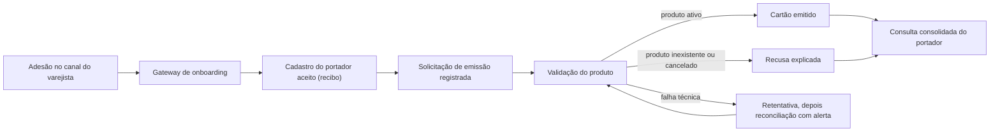

# Documento de Escopo: CardForge Release 1.0

Base: `intent-statement.md` (problema, métricas de sucesso, fronteira confirmada), `feasibility-assessment.md` (veredito "viável com condições", entrega até 05/10/2026), `constraint-register.md` (C-O1 a C-R6) e `scope-definition-questions.md` (Q1 a Q8).

## Objetivo do escopo

Entregar até 05/10/2026 a Release 1.0 do CardForge, com cadastro de portador e emissão de cartão separados. Nenhuma solicitação aceita se perde: cada solicitação tem no máximo um desfecho terminal, que nunca é reavaliado, e enquanto não o tiver permanece rastreável e recuperável, com alerta.

Quando o prazo apertar, só se reduz a profundidade dos itens listados na seção "Política de cortes", na ordem ali definida (Q2, Q3). O prazo não é estendido (C-O1).

## Dentro do escopo: núcleo inegociável

Estes itens nunca entram na lista de cortes (Q1, Q4, C-O4).

| Área | Conteúdo |
|---|---|
| Catálogo de produtos | Criar, consultar, listar paginado, atualizar dados descritivos, cancelar (BR-P1 a BR-P3) |
| Cadastro de portador | `Idempotency-Key` (replay por 24 h, 409 para requisição em andamento, 422 para payload diferente); validações de CPF, idade e nome; rejeição imediata de produto comprovadamente inexistente ou cancelado; aceite quando o catálogo ou a mensageria estiverem indisponíveis; solicitação de emissão publicada via outbox (BR-H1 a BR-H6, BR-R1 a BR-R5) |
| Emissão assíncrona | Validação do produto com a regra dos 5 minutos e o cache; geração do PAN; resultado terminal persistido e publicado; retry com backoff via SQS; DLQ com redrive policy (BR-I1 a BR-I5, BR-C1 a BR-C5) |
| Aplicação do resultado e consulta consolidada | Consumidor de resultados idempotente por estado; consulta consolidada com os quatro estados de completude (BR-V1 a BR-V3) |
| Status e histórico | Consultas e mudanças de status de portador e cartão, com histórico de transições (ator e instante) |
| Reconciliação | Republicação de solicitações antigas sem desfecho, em lotes limitados, com suspensão e alerta após N tentativas |
| Segurança | OAuth2 com Keycloak local (emissor, audiência, escopos); controles de aplicação alinhados a PCI-DSS e LGPD: PAN cifrado, só os 4 últimos dígitos, nada sensível em logs ou mensagens, histórico auditável; sem afirmar conformidade integral (C-R1 a C-R5) |
| Contratos de API | Tratamento global de exceções com ProblemDetail e códigos HTTP semânticos; OpenAPI por serviço |
| Ambiente e verificação | Ambiente completo com um comando; `scripts/smoke-test.sh`; `./mvnw verify` no CI com cobertura mínima de 80% de linhas por módulo de serviço, excluindo só a classe main e as classes de configuração |
| Testes obrigatórios | Os dez testes críticos, o teste de colisão de PAN e o de concorrência na mesma `Idempotency-Key`; cada regra BR-* rastreável a pelo menos um teste |
| Observabilidade (mínimo) | Propagação de correlationId e contexto W3C em HTTP e atributos SQS; métricas mínimas (ver cortes) |
| Documentação | README com setup, diagrama Mermaid, decisões técnicas, comportamento sob falha de cada dependência, estratégia de cache e como o sistema impede cartão para produto inexistente ou cancelado; collection do Postman sincronizada; ADRs |

### Formato dos ADRs

O formato curto é o padrão (Q8): as quatro seções (Contexto, Decisão, Consequências, Alternativas Rejeitadas), com uma ou duas linhas cada. Os ADRs de cache, retry/DLQ, outbox e idempotência são escritos completos. ADR só para decisões relevantes (`project.md` Way of Working).

## Política de cortes

Cortes pré-aprovados, sempre de profundidade e nunca de existência (Q2, Q4). Aplicam-se na ordem abaixo (Q3), e cada corte feito é registrado como débito conhecido no README (C-O3).

| Ordem | Corte | O que permanece | O que sai |
|---|---|---|---|
| 1 | Métricas mínimas | Emissões por status e motivo, pendências e idade do outbox, profundidade de filas e DLQs, hit/miss do cache, ocupação do BIN | Tempo de emissão, colisões de PAN, estado detalhado dos circuit breakers |
| 2 | Runbooks no README | Procedimento enxuto de DLQ e reconciliação no README | Documentos operacionais separados |
| 3 | Postman essencial | Fluxo feliz, token, `Idempotency-Key` e erros das regras críticas | Cobertura de todos os códigos de erro de cada endpoint |

## Fora do escopo

| Item | Fonte |
|---|---|
| Tudo o que está na seção 9 do brief: personalização física, CVV, HSM, ativação, limites, autorização de transações, faturas, cascata de status, recadastro, atualização cadastral, direito de exclusão, renovação e substituição, isolamento por parceiro, rotação automatizada de chaves, expansão de faixas de BIN, interface administrativa de DLQ e reconciliação | brief §9, `intent-statement.md` |
| Infraestrutura AWS de produção | C-I4, `intent-statement.md` |
| Conformidade integral com PCI-DSS ou LGPD | C-R1 |
| Teste de carga (as metas de desempenho ficam como não medidas) | Q7 |
| Interface gráfica de qualquer tipo | Q7 |
| Dashboards de métricas | Q7 |
| Servidores de observabilidade no Compose (Prometheus, Grafana, Zipkin/Jaeger); os serviços só expõem métricas e propagam o contexto de tracing | Q7, Q4 |

## Sequência de construção

Risco primeiro, respeitando as dependências (Q5). Cada garantia é entregue com seus testes críticos, nunca deixados para o fim.

1. **Esqueleto ponta a ponta:** token, produto, cadastro com `Idempotency-Key`, emissão via fila com o cache e consulta consolidada, verificados pelo smoke test (`project.md` Walking Skeleton).
2. **Emissão:** resultado persistido, idempotência, outbox, regra dos 5 minutos com cache, PAN, retry e DLQ.
3. **Cadastro:** `Idempotency-Key`, outbox, consumidor de resultados e reconciliação.
4. **Restante das APIs:** listagem e atualização do catálogo, mudanças de status com histórico, consulta consolidada completa.
5. **Observabilidade e documentação.**

Não há entregas intermediárias: tudo tem o prazo de 05/10/2026 (Q6).

## Mapa do fluxo de valor

<!-- Text fallback: a adesão no canal do varejista passa pelo gateway de onboarding e vira um cadastro aceito com recibo. O cadastro registra uma solicitação de emissão. A validação do produto leva ao cartão emitido (produto ativo), à recusa explicada (produto inexistente ou cancelado) ou à retentativa seguida de reconciliação com alerta (falha técnica), que volta à validação. Cartão emitido e recusa aparecem na consulta consolidada do portador. -->

## Assumptions & Open Questions

- A posição do CI com cobertura (`./mvnw verify` no GitHub Actions) na sequência não foi definida nas respostas. Sugestão: montar junto com o esqueleto, para que todo incremento seguinte já passe pelo CI. Confirmar na Delivery Planning.
