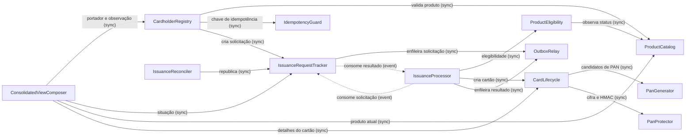

# Catálogo de Componentes: CardForge Release 1.0

Base: `requirements.md` (FR1 a FR11), `stories.md` (US0.1 a US8.4 e questões encaminhadas), `team-practices.md`, `product-brief.md` §4, `engineering-standards.md` e `domain-design-questions.md` (Q1 a Q6).

Os componentes são blocos de código que escrevemos. Banco, cache, filas e o provedor de identidade são dependências externas. A distribuição em unidades de entrega fica para a Geração de Unidades; aqui, o serviço aparece só como contexto, na coluna "Serviço" e em cada `summary`, porque a divisão em três serviços já é decisão registrada (brief §4, `project.md` Decided).

## Catálogo (fonte da verdade)

```yaml
components:
  - name: ProductCatalog
    summary: "[product-service] Dono do catálogo de produtos e do seu ciclo de vida."
    behaviour: >
      Cria produto ACTIVE com bin de 8 dígitos, único e imutável; atualiza só nome e descrição
      de produto ACTIVE (CANCELED é somente leitura, 409); cancela ACTIVE -> CANCELED (terminal);
      pedido para o status atual é idempotente; sem exclusão física; registra cada transição com
      ator (client_id e X-Actor-Id opcional) e instante na mesma transação.
    responsibilities:
      - Criar, consultar, listar com paginação, atualizar e cancelar produtos
      - Garantir unicidade e imutabilidade do bin
      - Registrar o histórico de transições de status do produto
    depends_on: []
    dependents:
      - component: CardholderRegistry
        interaction: Validar o produto no cadastro (existência e status)
      - component: ConsolidatedViewComposer
        interaction: Obter os dados atuais do produto para a consulta consolidada
      - component: ProductEligibility
        interaction: Observar o status do produto para autorizar a emissão
    external_dependencies:
      - name: PostgreSQL (database do product-service)
        kind: database
        purpose: Persistir produtos e histórico
    entities:
      - name: Product
        identifier: id
        attributes: [id, name, description, bin, status, createdAt, updatedAt, version]
      - name: ProductStatusTransition
        identifier: id
        attributes: [id, productId, fromStatus, toStatus, actorClientId, actorId, occurredAt]
        references:
          - entity: Product
            owned_by: ProductCatalog
            relationship: "cada transição pertence a um produto"

  - name: IdempotencyGuard
    summary: "[cardholder-service] Garante que o cadastro repetido com a mesma Idempotency-Key devolva o mesmo recibo."
    behaviour: >
      Adquire a chave (client_id + Idempotency-Key UUID) na mesma transação do cadastro, com lock
      curto; só um cadastro aceito consome a chave; mesma chave e mesmo payload (fingerprint HMAC)
      devolve o recibo original com Idempotent-Replayed por 24 h; payload diferente gera 422;
      original em andamento além do lock gera 409 (inclusive com payload diferente); chave com mais
      de 24 h é tratada como nova; limpeza periódica das expiradas.
    responsibilities:
      - Adquirir e validar chaves de idempotência por client_id
      - Guardar o recibo de aceite e o fingerprint do payload
      - Expirar e limpar chaves após 24 h
    depends_on: []
    dependents:
      - component: CardholderRegistry
        interaction: Proteger o cadastro contra repetição
    external_dependencies:
      - name: PostgreSQL (database do cardholder-service)
        kind: database
        purpose: Tabela de chaves de idempotência
    entities:
      - name: IdempotencyKey
        identifier: "clientId + key"
        attributes: [clientId, key, fingerprint, receipt, createdAt, expiresAt]

  - name: CardholderRegistry
    summary: "[cardholder-service] Dono do portador: cadastro, consulta, status e a última observação do produto conhecida pelo cadastro."
    behaviour: >
      Valida CPF (dígitos verificadores, sem sequências repetidas, guardado só com dígitos, único em
      toda a base), idade (18 a 120 anos, com Clock), nome (3 a 120, nome e sobrenome) e productId;
      consulta o catálogo fora da transação, com orçamento curto e sem retentativa: inexistente ou
      CANCELED gera 422 e nada é criado; timeout, 5xx, conexão recusada, 401, 403 ou contrato
      inválido aceitam o cadastro (os três últimos com alerta de configuração); grava na mesma
      transação chave, portador ACTIVE, solicitação PENDING e outbox; responde 202 só depois do
      commit. Transições ACTIVE<->BLOCKED e ACTIVE/BLOCKED->CANCELED, com histórico; CPF mascarado
      nas respostas; sem exclusão física. Guarda a observação do produto feita no cadastro.
    responsibilities:
      - Cadastrar e consultar portadores
      - Aplicar as regras BR2.1 a BR2.6 e BR3.3 a BR3.5
      - Alterar o status do portador e registrar o histórico
      - Guardar a última observação do produto conhecida pelo cadastro
    depends_on:
      - component: ProductCatalog
        interaction: Validar o produto antes da transação de cadastro
        style: sync
      - component: IdempotencyGuard
        interaction: Adquirir a chave e obter replay ou conflito
        style: sync
      - component: IssuanceRequestTracker
        interaction: Criar a solicitação de emissão na transação do cadastro
        style: sync
    dependents:
      - component: ConsolidatedViewComposer
        interaction: Ler o portador e ler ou atualizar a observação do produto
    external_dependencies:
      - name: PostgreSQL (database do cardholder-service)
        kind: database
        purpose: Portadores, histórico e observações de produto
      - name: Provedor de identidade (Keycloak local)
        kind: third-party-api
        purpose: Token de client credentials para chamar o catálogo
    entities:
      - name: Cardholder
        identifier: id
        attributes: [id, cpf, fullName, birthDate, productId, status, createdAt, updatedAt, version]
        references:
          - entity: Product
            owned_by: ProductCatalog
            relationship: "cada portador foi cadastrado para um produto desejado"
      - name: CardholderStatusTransition
        identifier: id
        attributes: [id, cardholderId, fromStatus, toStatus, actorClientId, actorId, occurredAt]
        references:
          - entity: Cardholder
            owned_by: CardholderRegistry
            relationship: "cada transição pertence a um portador"
      - name: ProductObservation
        identifier: productId
        attributes: [productId, name, bin, status, observedAt]
        references:
          - entity: Product
            owned_by: ProductCatalog
            relationship: "cópia local da última observação de um produto do catálogo"

  - name: IssuanceRequestTracker
    summary: "[cardholder-service] Dono da solicitação de emissão como vista pelo cliente e da aplicação do resultado."
    behaviour: >
      Cria a solicitação PENDING e o evento card-issuance-requested no outbox; consome
      card-issuance-completed de forma idempotente por estado: PENDING aplica ISSUED (com cardId)
      ou FAILED (com motivo); o mesmo resultado terminal não muda nada; resultado contraditório
      não muda nada, gera alerta e vai de forma explícita e imediata para a DLQ; solicitação
      desconhecida ou mensagem inválida gera alerta e vai de forma explícita e imediata para a DLQ,
      preservando a original; resultado para solicitação suspensa é aplicado e encerra a suspensão;
      registra a mudança de situação no histórico da solicitação.
    responsibilities:
      - Criar e publicar solicitações de emissão
      - Aplicar resultados de emissão com idempotência por estado
      - Manter contador e instante de reconciliação e a marca de suspensão
      - Registrar o histórico de situação da solicitação
    depends_on:
      - component: OutboxRelay
        interaction: Enfileirar o evento de solicitação na transação de negócio
        style: sync
      - component: IssuanceProcessor
        interaction: Consumir os resultados publicados em card-issuance-completed
        style: event
    dependents:
      - component: CardholderRegistry
        interaction: Criar a solicitação no cadastro
      - component: IssuanceReconciler
        interaction: Selecionar e republicar solicitações sem desfecho
      - component: ConsolidatedViewComposer
        interaction: Ler a situação da emissão
      - component: IssuanceProcessor
        interaction: Consumir as solicitações publicadas em card-issuance-requested
    external_dependencies:
      - name: PostgreSQL (database do cardholder-service)
        kind: database
        purpose: Solicitações e histórico de situação
      - name: SQS card-issuance-completed (+ DLQ)
        kind: queue
        purpose: Receber resultados; DLQ para inválidos, desconhecidos e contraditórios
    entities:
      - name: IssuanceRequest
        identifier: id
        attributes: [id, cardholderId, productId, status, failureReason, cardId, requestedAt, decidedAt, reconciliationAttempts, lastReconciliationAt, suspended]
        references:
          - entity: Cardholder
            owned_by: CardholderRegistry
            relationship: "cada solicitação pertence a um portador"
          - entity: Product
            owned_by: ProductCatalog
            relationship: "cada solicitação é para um produto"
          - entity: Card
            owned_by: CardLifecycle
            relationship: "uma solicitação ISSUED aponta para o cartão emitido"
      - name: IssuanceStatusTransition
        identifier: id
        attributes: [id, issuanceRequestId, fromStatus, toStatus, actorClientId, occurredAt]
        references:
          - entity: IssuanceRequest
            owned_by: IssuanceRequestTracker
            relationship: "cada transição pertence a uma solicitação"

  - name: IssuanceReconciler
    summary: "[cardholder-service] Recupera solicitações sem desfecho sem gerar cartão duplicado."
    behaviour: >
      A cada 5 min (configurável) seleciona com SKIP LOCKED até 50 solicitações PENDING com mais de
      3 h e pelo menos 30 min desde a última tentativa; republica pelo outbox na mesma transação que
      incrementa o contador; após 3 tentativas sem desfecho suspende a republicação automática,
      marca para intervenção e gera alerta. Todos os limites vêm de configuração e do Clock.
    responsibilities:
      - Selecionar solicitações elegíveis à reconciliação
      - Republicar e contar tentativas
      - Suspender e alertar após o limite
    depends_on:
      - component: IssuanceRequestTracker
        interaction: Ler, republicar e atualizar solicitações
        style: sync
    dependents: []
    external_dependencies: []
    entities: []

  - name: ConsolidatedViewComposer
    summary: "[cardholder-service] Monta a consulta consolidada separando estado de negócio de completude da informação."
    behaviour: >
      Lê o portador e a situação da solicitação; consulta o catálogo com timeout: sucesso atualiza a
      ProductObservation e o produto sai atual; falha usa a observação guardada, sinalizada como
      desatualizada com o instante (toda observação que não veio do catálogo na própria requisição);
      sem observação, o produto sai indisponível. Para ISSUED, consulta o card-service com timeout;
      em falha a situação continua ISSUED com o cardId e só os detalhes ficam indisponíveis. PENDING
      e FAILED não chamam o card-service. Sempre 200, com os cinco casos distinguíveis por campos
      estruturados; portador inexistente gera 404.
    responsibilities:
      - Compor portador, situação, cartão e produto
      - Classificar a completude e a atualidade de cada parte
    depends_on:
      - component: CardholderRegistry
        interaction: Ler o portador e ler ou atualizar a observação do produto
        style: sync
      - component: IssuanceRequestTracker
        interaction: Ler a situação da emissão
        style: sync
      - component: ProductCatalog
        interaction: Consultar o produto atual
        style: sync
      - component: CardLifecycle
        interaction: Consultar os detalhes do cartão emitido
        style: sync
    dependents: []
    external_dependencies:
      - name: Provedor de identidade (Keycloak local)
        kind: third-party-api
        purpose: Token de client credentials para chamar catálogo e card-service
    entities: []

  - name: IssuanceProcessor
    summary: "[card-service] Decide a emissão de cada solicitação exatamente uma vez e publica o resultado."
    behaviour: >
      Consome card-issuance-requested; se já existe resultado em IssuanceProcessing, nunca reavalia e
      recoloca o resultado no outbox antes de confirmar; senão pede a elegibilidade do produto
      (observação ACTIVE de no máximo 5 min), emite o cartão, e grava cartão, resultado ISSUED e
      outbox na mesma transação; recusas de negócio (PRODUCT_NOT_FOUND, PRODUCT_CANCELED,
      NON_CANCELED_CARD_ALREADY_EXISTS) gravam FAILED e outbox, sem retentativa; após violação de
      unicidade refaz a decisão do início; classifica falhas em negócio, transitória (backoff 30 s
      dobrando, jitter ±20%, teto 300 s), mensagem inválida (DLQ + alerta) e configuração (alerta);
      confirma a mensagem só depois do commit; nunca faz chamada remota dentro da transação.
    responsibilities:
      - Consumir solicitações e garantir no máximo um desfecho terminal
      - Orquestrar elegibilidade, emissão e publicação do resultado
      - Classificar falhas e controlar a retentativa pela visibilidade da mensagem
    depends_on:
      - component: IssuanceRequestTracker
        interaction: Consumir as solicitações publicadas em card-issuance-requested
        style: event
      - component: ProductEligibility
        interaction: Obter uma observação ACTIVE elegível ou o desfecho de negócio
        style: sync
      - component: CardLifecycle
        interaction: Criar o cartão com unicidade garantida
        style: sync
      - component: OutboxRelay
        interaction: Enfileirar o resultado na transação de negócio
        style: sync
    dependents:
      - component: IssuanceRequestTracker
        interaction: Consumir os resultados publicados em card-issuance-completed
    external_dependencies:
      - name: PostgreSQL (database do card-service)
        kind: database
        purpose: Resultados de emissão (issuance_processing)
      - name: SQS card-issuance-requested (+ DLQ)
        kind: queue
        purpose: Receber solicitações; backoff por ChangeMessageVisibility
    entities:
      - name: IssuanceProcessing
        identifier: issuanceRequestId
        attributes: [issuanceRequestId, status, cardId, failureReason, processedAt]
        references:
          - entity: IssuanceRequest
            owned_by: IssuanceRequestTracker
            relationship: "o resultado terminal de uma solicitação, visto pelo card-service"
          - entity: Card
            owned_by: CardLifecycle
            relationship: "um resultado ISSUED aponta para o cartão criado"

  - name: ProductEligibility
    summary: "[card-service] Autoridade sobre 'o produto pode emitir agora?', com o cache de observações."
    behaviour: >
      Usa o registro do cache só se validatedAt tiver no máximo 5 min (inclusivo, com Clock); ler
      nunca renova validatedAt; senão consulta o catálogo (uma tentativa por processamento, com
      timeout e circuit breaker): ACTIVE grava novo validatedAt; CANCELED ou 404 impedem qualquer
      ACTIVE antigo de ser usado ou restaurado por uma resposta mais antiga; 401, 403 ou contrato
      inválido são falha de configuração, nunca PRODUCT_NOT_FOUND; Redis indisponível consulta o
      catálogo e registra a degradação; Redis e catálogo indisponíveis sem registro elegível são
      falha transitória. TTL físico de 24 h; registros antigos só servem a consultas, sinalizados.
    responsibilities:
      - Decidir a elegibilidade do produto para emissão (BR4.1, BR1.3)
      - Manter o cache de observações de produto
      - Classificar as respostas do catálogo
    depends_on:
      - component: ProductCatalog
        interaction: Observar o status atual do produto
        style: sync
    dependents:
      - component: IssuanceProcessor
        interaction: Autorizar ou recusar a emissão
    external_dependencies:
      - name: Redis
        kind: cache
        purpose: "Registro único por produto (cardforge:product:v1:{id}) com validatedAt"
      - name: Provedor de identidade (Keycloak local)
        kind: third-party-api
        purpose: Token de client credentials para chamar o catálogo
    entities:
      - name: CachedProductObservation
        identifier: productId
        attributes: [productId, name, bin, status, validatedAt]
        references:
          - entity: Product
            owned_by: ProductCatalog
            relationship: "observação em cache de um produto do catálogo"

  - name: CardLifecycle
    summary: "[card-service] Dono do cartão: criação única, consulta, status e ocupação do BIN."
    behaviour: >
      Cria o cartão ACTIVE com validade de 5 anos (mês/ano, com Clock) e sem CVV; garante unicidade
      por pan_hmac (ON CONFLICT, até 20 tentativas; esgotar é falha técnica com alerta), por
      issuance_request_id e um cartão não cancelado por portador e produto (índice parcial);
      expõe só panLastFour; transições ACTIVE<->BLOCKED e ACTIVE/BLOCKED->CANCELED com histórico,
      pedido para o status atual é idempotente; sem exclusão física; mede a ocupação por BIN com
      alerta em 70%.
    responsibilities:
      - Criar cartões com as garantias de unicidade
      - Consultar e listar cartões e alterar seu status
      - Registrar o histórico de transições do cartão
      - Medir a ocupação da faixa de cada BIN
    depends_on:
      - component: PanGenerator
        interaction: Obter candidatos de PAN
        style: sync
      - component: PanProtector
        interaction: Cifrar o PAN e derivar o pan_hmac
        style: sync
    dependents:
      - component: IssuanceProcessor
        interaction: Criar o cartão da solicitação
      - component: ConsolidatedViewComposer
        interaction: Consultar os detalhes do cartão
    external_dependencies:
      - name: PostgreSQL (database do card-service)
        kind: database
        purpose: Cartões e histórico
    entities:
      - name: Card
        identifier: id
        attributes: [id, cardholderId, productId, issuanceRequestId, panCiphertext, panKeyVersion, panHmac, panLastFour, expirationDate, status, createdAt, updatedAt, version]
        references:
          - entity: Cardholder
            owned_by: CardholderRegistry
            relationship: "cada cartão pertence a um portador"
          - entity: Product
            owned_by: ProductCatalog
            relationship: "cada cartão é de um produto"
          - entity: IssuanceRequest
            owned_by: IssuanceRequestTracker
            relationship: "cada cartão nasce de exatamente uma solicitação"
      - name: CardStatusTransition
        identifier: id
        attributes: [id, cardId, fromStatus, toStatus, actorClientId, actorId, occurredAt]
        references:
          - entity: Card
            owned_by: CardLifecycle
            relationship: "cada transição pertence a um cartão"

  - name: PanGenerator
    summary: "[card-service] Gera candidatos de PAN: bin + 7 dígitos aleatórios + dígito de Luhn."
    behaviour: >
      Usa uma fonte aleatória criptográfica (SecureRandom) atrás de uma porta substituível em teste,
      para permitir forçar colisões; calcula o dígito de Luhn; não conhece banco nem chaves.
    responsibilities:
      - Gerar candidatos de PAN válidos para um bin
    depends_on: []
    dependents:
      - component: CardLifecycle
        interaction: Fornecer candidatos de PAN
    external_dependencies: []
    entities: []

  - name: PanProtector
    summary: "[card-service] Protege o PAN: cifragem autenticada e identificador de unicidade."
    behaviour: >
      Cifra com AES-256-GCM, nonce único por operação e versão da chave gravada com o dado; deriva
      pan_hmac com chave separada; lê as chaves de arquivos montados (./.local/secrets no ambiente
      local); impede a inicialização se uma chave estiver ausente, malformada ou igual a outra;
      nunca registra o PAN.
    responsibilities:
      - Cifrar e decifrar o PAN
      - Derivar o identificador de unicidade do PAN
      - Validar o material de chaves na inicialização
    depends_on: []
    dependents:
      - component: CardLifecycle
        interaction: Proteger o PAN antes da gravação
    external_dependencies:
      - name: Arquivos de segredo montados (./.local/secrets)
        kind: other
        purpose: Chaves de cifragem e HMAC do PAN
    entities: []

  - name: OutboxRelay
    summary: "[cardforge-platform, instanciado em cardholder-service e card-service] Publica eventos gravados na transação de negócio."
    behaviour: >
      Grava o evento (envelope eventId, eventType, eventVersion, occurredAt, correlationId,
      traceparent, payload mínimo sem dados pessoais) na tabela de outbox do serviço, na transação
      do chamador; um worker agendado seleciona até 10 eventos com FOR UPDATE SKIP LOCKED, envia por
      SendMessageBatch com timeout curto mantendo o lock e marca como enviados só os aceitos; expõe
      pendências e idade do mais antigo. Não contém tipos nem regras de domínio.
    responsibilities:
      - Persistir eventos na transação de negócio
      - Publicar em lote com entrega pelo menos uma vez
      - Propagar correlationId e contexto de tracing
    depends_on: []
    dependents:
      - component: IssuanceRequestTracker
        interaction: Publicar solicitações de emissão
      - component: IssuanceProcessor
        interaction: Publicar resultados de emissão
    external_dependencies:
      - name: PostgreSQL (database de cada serviço que publica)
        kind: database
        purpose: Tabela de outbox
      - name: SQS (card-issuance-requested, card-issuance-completed)
        kind: queue
        purpose: Destino das publicações
    entities:
      - name: OutboxEvent
        identifier: eventId
        attributes: [eventId, aggregateId, eventType, eventVersion, occurredAt, correlationId, traceparent, payload, sentAt]
```

## Diagrama de componentes



<!-- Text fallback: CardholderRegistry chama ProductCatalog, IdempotencyGuard e IssuanceRequestTracker. IssuanceRequestTracker usa OutboxRelay e consome eventos de resultado do IssuanceProcessor. IssuanceReconciler chama IssuanceRequestTracker. ConsolidatedViewComposer chama CardholderRegistry, IssuanceRequestTracker, ProductCatalog e CardLifecycle. IssuanceProcessor consome eventos de solicitação do IssuanceRequestTracker e chama ProductEligibility, CardLifecycle e OutboxRelay. ProductEligibility chama ProductCatalog. CardLifecycle chama PanGenerator e PanProtector. As setas tracejadas são eventos assíncronos pela SQS. -->

As setas tracejadas formam o único ciclo do grafo: solicitações vão do cadastro para a emissão e resultados voltam. O ciclo é deliberado e assíncrono (ADR-005).

## Resumo dos componentes

| Componente | Serviço | Propósito | Depende de | Dependentes | Entidades |
|---|---|---|---|---|---|
| ProductCatalog | product-service | Catálogo e ciclo de vida do produto | — | CardholderRegistry, ConsolidatedViewComposer, ProductEligibility | Product, ProductStatusTransition |
| IdempotencyGuard | cardholder-service | Replay seguro do cadastro | — | CardholderRegistry | IdempotencyKey |
| CardholderRegistry | cardholder-service | Portador, status e observação do produto | ProductCatalog, IdempotencyGuard, IssuanceRequestTracker | ConsolidatedViewComposer | Cardholder, CardholderStatusTransition, ProductObservation |
| IssuanceRequestTracker | cardholder-service | Solicitação e aplicação do resultado | OutboxRelay, IssuanceProcessor (evento) | CardholderRegistry, IssuanceReconciler, ConsolidatedViewComposer, IssuanceProcessor | IssuanceRequest, IssuanceStatusTransition |
| IssuanceReconciler | cardholder-service | Recuperação de solicitações sem desfecho | IssuanceRequestTracker | — | — |
| ConsolidatedViewComposer | cardholder-service | Consulta consolidada | CardholderRegistry, IssuanceRequestTracker, ProductCatalog, CardLifecycle | — | — |
| IssuanceProcessor | card-service | Decisão única da emissão | IssuanceRequestTracker (evento), ProductEligibility, CardLifecycle, OutboxRelay | IssuanceRequestTracker | IssuanceProcessing |
| ProductEligibility | card-service | Elegibilidade do produto e cache | ProductCatalog | IssuanceProcessor | CachedProductObservation |
| CardLifecycle | card-service | Cartão, status e ocupação do BIN | PanGenerator, PanProtector | IssuanceProcessor, ConsolidatedViewComposer | Card, CardStatusTransition |
| PanGenerator | card-service | Candidatos de PAN | — | CardLifecycle | — |
| PanProtector | card-service | Cifragem e HMAC do PAN | — | CardLifecycle | — |
| OutboxRelay | cardforge-platform | Publicação transacional de eventos | — | IssuanceRequestTracker, IssuanceProcessor | OutboxEvent |

## Propriedade das entidades

| Entidade | Componente dono | Identificador | Atributos | Referências |
|---|---|---|---|---|
| Product | ProductCatalog | id | id, name, description, bin, status, createdAt, updatedAt, version | — |
| ProductStatusTransition | ProductCatalog | id | id, productId, fromStatus, toStatus, actorClientId, actorId, occurredAt | Product |
| IdempotencyKey | IdempotencyGuard | clientId + key | clientId, key, fingerprint, receipt, createdAt, expiresAt | — |
| Cardholder | CardholderRegistry | id | id, cpf, fullName, birthDate, productId, status, createdAt, updatedAt, version | Product (ProductCatalog) |
| CardholderStatusTransition | CardholderRegistry | id | id, cardholderId, fromStatus, toStatus, actorClientId, actorId, occurredAt | Cardholder |
| ProductObservation | CardholderRegistry | productId | productId, name, bin, status, observedAt | Product (ProductCatalog) |
| IssuanceRequest | IssuanceRequestTracker | id | id, cardholderId, productId, status, failureReason, cardId, requestedAt, decidedAt, reconciliationAttempts, lastReconciliationAt, suspended | Cardholder, Product, Card |
| IssuanceStatusTransition | IssuanceRequestTracker | id | id, issuanceRequestId, fromStatus, toStatus, actorClientId, occurredAt | IssuanceRequest |
| IssuanceProcessing | IssuanceProcessor | issuanceRequestId | issuanceRequestId, status, cardId, failureReason, processedAt | IssuanceRequest, Card |
| CachedProductObservation | ProductEligibility | productId | productId, name, bin, status, validatedAt | Product (ProductCatalog) |
| Card | CardLifecycle | id | id, cardholderId, productId, issuanceRequestId, panCiphertext, panKeyVersion, panHmac, panLastFour, expirationDate, status, createdAt, updatedAt, version | Cardholder, Product, IssuanceRequest |
| CardStatusTransition | CardLifecycle | id | id, cardId, fromStatus, toStatus, actorClientId, actorId, occurredAt | Card |
| OutboxEvent | OutboxRelay | eventId | eventId, aggregateId, eventType, eventVersion, occurredAt, correlationId, traceparent, payload, sentAt | — |

As referências entre serviços são apenas por ID. Nenhuma tabela é escrita por mais de um serviço (cada serviço tem o seu database).

## Dependências externas

| Componente | Dependência | Tipo | Propósito |
|---|---|---|---|
| ProductCatalog | PostgreSQL (product-service) | database | Produtos e histórico |
| IdempotencyGuard | PostgreSQL (cardholder-service) | database | Chaves de idempotência |
| CardholderRegistry | PostgreSQL (cardholder-service) | database | Portadores, histórico, observações |
| CardholderRegistry | Keycloak local | third-party-api | Client credentials para o catálogo |
| IssuanceRequestTracker | PostgreSQL (cardholder-service) | database | Solicitações e histórico |
| IssuanceRequestTracker | SQS card-issuance-completed + DLQ | queue | Receber resultados |
| ConsolidatedViewComposer | Keycloak local | third-party-api | Client credentials para catálogo e card-service |
| IssuanceProcessor | PostgreSQL (card-service) | database | `issuance_processing` |
| IssuanceProcessor | SQS card-issuance-requested + DLQ | queue | Receber solicitações |
| ProductEligibility | Redis | cache | Observações de produto com `validatedAt` |
| ProductEligibility | Keycloak local | third-party-api | Client credentials para o catálogo |
| CardLifecycle | PostgreSQL (card-service) | database | Cartões e histórico |
| PanProtector | Arquivos de segredo montados | other | Chaves do PAN |
| OutboxRelay | PostgreSQL (de cada serviço) + SQS | database, queue | Outbox e publicação |

## Justificativa

| Componente | Por que é um bloco separado |
|---|---|
| ProductCatalog | Dono exclusivo do produto (brief §4); muda raramente e tem ciclo de vida próprio |
| IdempotencyGuard | Preocupação distinta do portador: protocolo de repetição com dados e expiração próprios (24 h) |
| CardholderRegistry | Dono dos dados pessoais do portador; concentra as regras de cadastro |
| IssuanceRequestTracker | A solicitação tem ciclo de vida próprio (`PENDING` → terminal), diferente do portador, e é o ponto de consistência com o card-service |
| IssuanceReconciler | Processo agendado com parâmetros e alertas próprios; muda por razões operacionais, não de negócio |
| ConsolidatedViewComposer | Leitura composta com regras de completude próprias (cinco casos); sem dados próprios |
| IssuanceProcessor | Decisão única da emissão; concentra as garantias de idempotência e a classificação de falhas |
| ProductEligibility | Autoridade da regra dos 5 minutos (BR4.1) e dona do cache; muda com a estratégia de cache, não com a emissão |
| CardLifecycle | Dono do cartão e das suas constraints de unicidade |
| PanGenerator | Isolado por testabilidade: a porta da fonte aleatória permite forçar colisões (TC-PAN) |
| PanProtector | Material de chaves e cifragem isolados; menor superfície de exposição do PAN |
| OutboxRelay | Mecanismo técnico idêntico nos dois serviços que publicam; sem domínio (ADR-004) |

### Alternativas rejeitadas

- **Um componente por serviço (Q1, B):** esconderia responsabilidades com ritmos de mudança diferentes (reconciliação, cache, PAN) e dificultaria ligar cada teste crítico ao bloco que ele protege.
- **Card-service expondo o produto do cache à consulta consolidada (Q2, B):** criaria uma dependência de leitura do cadastro sobre a emissão e acoplaria a consulta à disponibilidade do card-service também para o produto.
- **Cadastro lendo o Redis do card-service (Q2, C):** quebraria a propriedade do cache (dono único) e o isolamento por serviço.
