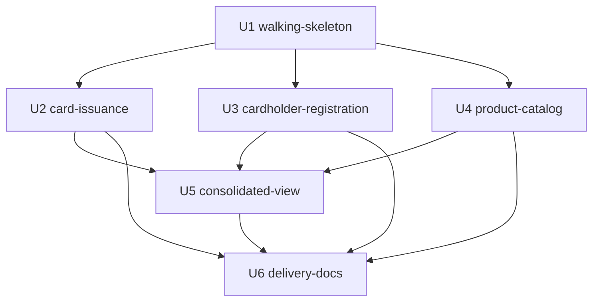

# Dependências entre Unidades: CardForge Release 1.0

Base: `unit-of-work.md`, `components.md` (dependências entre componentes) e `units-generation-questions.md`. Este documento descreve só a topologia. A ordem de construção e o caminho crítico são decididos na Delivery Planning.

## Grafo

```yaml
units:
  - name: walking-skeleton
    kind: service
    depends_on: []
  - name: card-issuance
    kind: service
    depends_on: [walking-skeleton]
  - name: cardholder-registration
    kind: service
    depends_on: [walking-skeleton]
  - name: product-catalog
    kind: service
    depends_on: [walking-skeleton]
  - name: consolidated-view
    kind: service
    depends_on: [card-issuance, cardholder-registration, product-catalog]
  - name: delivery-docs
    kind: packaging
    depends_on: [card-issuance, cardholder-registration, product-catalog, consolidated-view]
```



<!-- Text fallback: U2, U3 e U4 dependem de U1. U5 depende de U2, U3 e U4. U6 depende de U2, U3, U4 e U5. As setas vão da dependência para a unidade dependente. -->

## Arestas e motivos

| Unidade | Depende de | Motivo |
|---|---|---|
| U2 card-issuance | U1 | Estende os componentes do card-service criados no esqueleto e usa o outbox do `cardforge-platform`, as filas e o Redis do Compose |
| U3 cardholder-registration | U1 | Estende o cadastro, o tracker e o outbox criados no esqueleto |
| U4 product-catalog | U1 | Estende o `ProductCatalog` criado no esqueleto e usa o `cardforge-platform` só para correlationId e ProblemDetail (sem outbox) |
| U5 consolidated-view | U2, U3, U4 | Os cinco casos precisam do cartão por ID e da sua indisponibilidade (U2), das situações `FAILED` e da observação do produto (U3) e do produto atual e cancelado (U4) |
| U6 delivery-docs | U2, U3, U4, U5 | Consolida o que cada unidade documentou |

## Pontos de integração

| De | Para | Tipo | Contrato |
|---|---|---|---|
| cardholder-service (U3, U5) | product-service (U4) | HTTP síncrono, client credentials | Consulta de produto por ID |
| card-service (U2) | product-service (U4) | HTTP síncrono, client credentials | Consulta de produto por ID (observação para a emissão) |
| cardholder-service (U3) | card-service (U2) | Evento SQS `card-issuance-requested` | Envelope com `issuanceRequestId`, `cardholderId`, `productId` |
| card-service (U2) | cardholder-service (U3) | Evento SQS `card-issuance-completed` | Envelope com `issuanceRequestId`, `status`, `failureReason`, `cardId` |
| cardholder-service (U5) | card-service (U2) | HTTP síncrono, client credentials | Consulta de cartão por ID |
| Gateway | Três serviços | HTTP, JWT | APIs públicas versionadas |

A forma exata de cada contrato é definida no Desenho de Contratos. O ciclo cadastro ↔ emissão existe só no nível dos eventos (ADR-005); entre unidades não há ciclo.

## Primeira unidade: o esqueleto

A U1 é a primeira unidade em qualquer ordenação do grafo e roda sozinha. Ela já contém caminhos finos e corretos de todos os componentes do fluxo principal nos três serviços, a infraestrutura local e o CI. Por isso o smoke test pode ser executado contra ela antes de qualquer outra unidade existir. As unidades seguintes estendem os mesmos componentes, sem substituí-los.

## Paralelismo possível

- U2, U3 e U4 não dependem umas das outras e podem ser construídas em qualquer ordem, ou intercaladas, depois da U1.
- U5 exige as três.
- U6 exige todas as anteriores.
